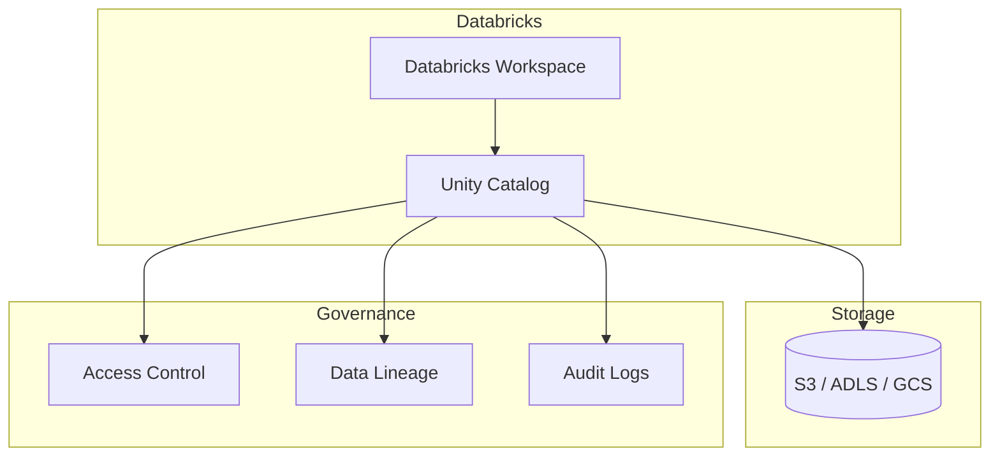

# Databricks Unity Catalog

Unity Catalog is Databricks' unified governance solution providing centralised access control,
auditing, lineage, and data discovery across all data assets.

---

## Architecture



---

## Three-Level Namespace

Unity Catalog organises data using a **three-level namespace**:

```text
catalog.schema.table
```

!!! note
    In Unity Catalog, **schema** is synonymous with **database**. The terms are interchangeable,
    but Unity Catalog documentation prefers *schema*.

| Level   | Description                                  | Example      |
|---------|----------------------------------------------|--------------|
| Catalog | Top-level container for schemas              | `main`       |
| Schema  | Groups related tables, views, and functions  | `analytics`  |
| Table   | The actual data object                       | `events`     |

---

## Configuration & Setup

Enable Unity Catalog and set the active catalog/schema using the helper functions in
[`src/metastore/dbx_uc/dbx_uc.py`](../../../src/metastore/dbx_uc/dbx_uc.py):

```python
def enable_unity_catalog(spark, workspace_url):
    spark.conf.set("spark.databricks.unityCatalog.enabled", "true")  # (1)!
    spark.conf.set("spark.databricks.unityCatalog.workspaceUrl", workspace_url)

def set_catalog_and_schema(spark, catalog_name, schema_name):
    spark.sql(f"USE CATALOG {catalog_name}")  # (2)!
    spark.sql(f"USE SCHEMA {schema_name}")
```

1. Activates Unity Catalog as the metastore for the Spark session.
2. Switches the session context so subsequent unqualified queries resolve against this catalog and schema.

---

## Key Features

| Feature                     | Description                                                              |
|-----------------------------|--------------------------------------------------------------------------|
| Fine-grained ACLs           | Grant/revoke permissions at catalog, schema, table, column level         |
| Row/column-level security   | Restrict access to specific rows or columns within a table               |
| Data lineage                | Automatic tracking of data flow across tables and notebooks              |
| Audit logging               | Record of all access and modifications for compliance                    |
| Managed/external locations  | Control where data is physically stored (cloud storage paths)            |
| Delta Sharing               | Open protocol for secure cross-organisation data sharing                 |

---

## SQL Examples

### Creating Catalogs and Schemas

```sql
-- Create a new catalog
CREATE CATALOG IF NOT EXISTS analytics_catalog;

-- Create a schema inside the catalog
CREATE SCHEMA IF NOT EXISTS analytics_catalog.marketing;
```

### Granting and Revoking Permissions

```sql
-- Grant read access on a schema
GRANT USAGE ON SCHEMA analytics_catalog.marketing TO `data-readers`;

-- Grant SELECT on a specific table
GRANT SELECT ON TABLE analytics_catalog.marketing.campaigns TO `data-readers`;

-- Revoke access
REVOKE SELECT ON TABLE analytics_catalog.marketing.campaigns FROM `data-readers`;

-- Inspect current grants
SHOW GRANTS ON TABLE analytics_catalog.marketing.campaigns;
```

### Switching Context and Querying

```sql
-- Set active catalog and schema
USE CATALOG analytics_catalog;
USE SCHEMA marketing;

-- Create a managed table
CREATE TABLE campaigns (
    id       INT,
    name     STRING,
    budget   DOUBLE
);

-- Query the table
SELECT * FROM campaigns WHERE budget > 10000;

-- Inspect table metadata and lineage info
DESCRIBE TABLE EXTENDED campaigns;
```

---

## Comparison with Hive Metastore

| Capability              | Hive Metastore            | Unity Catalog                        |
|-------------------------|---------------------------|--------------------------------------|
| Namespace levels        | `database.table`          | `catalog.schema.table`               |
| Access control          | Basic (table-level)       | Fine-grained (column/row-level)      |
| Data lineage            | ✗ Not built-in            | ✓ Automatic                          |
| Audit logging           | ✗ Requires external tools | ✓ Built-in                           |
| Cross-workspace sharing | ✗                         | ✓ Via Delta Sharing                  |
| Multi-cloud storage     | Manual configuration      | Managed/external locations           |
| Open-source             | ✓                         | ✗ Databricks-only                    |

---

## When to Use

!!! success "Good fit"
    - **Enterprise Databricks deployments** requiring centralised governance.
    - Organisations with **data governance and compliance requirements** (GDPR, HIPAA).
    - **Multi-workspace environments** where data must be shared securely across teams.

!!! failure "Not a good fit"
    - **Open-source Apache Spark** — Unity Catalog requires a Databricks runtime.
    - **Non-Databricks environments** (EMR, Dataproc, standalone Spark).

---

## Additional Notes

!!! note
    Unity Catalog is a **Databricks-specific feature** and is not available in open-source
    Apache Spark. Your Spark clusters must run on a Databricks workspace to use it.

!!! tip
    If you are migrating from Hive Metastore to Unity Catalog, use the
    **Databricks UCX migration tool** to automate catalog/schema/table migration and
    permission mapping.
