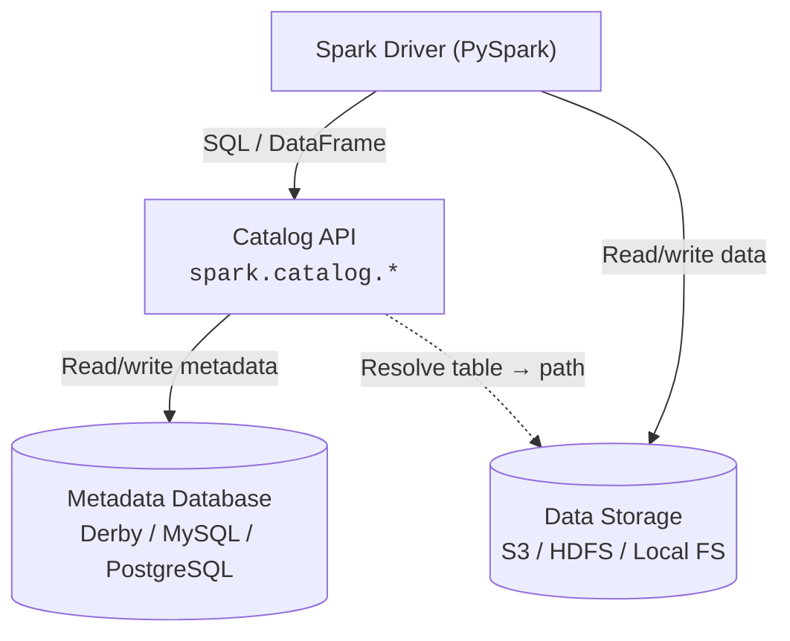

# Metastore Concepts Overview

This guide provides a comprehensive overview of how Apache Spark manages metadata—databases, tables, columns, partitions, and storage locations—through its **metastore** subsystem.

---

## What is a Metastore?

A metastore is a **relational database** that stores structural metadata about your data assets. Without a metastore, every Spark query would need to specify full file paths and schemas manually. With one, Spark resolves table names like `sales.orders` to physical file locations automatically.

### Why It Matters

- **Persistent table definitions** survive across Spark sessions and applications
- **SQL access** to files: `SELECT * FROM orders` instead of reading Parquet paths
- **Schema enforcement** ensures data quality at write time
- **Partition pruning** uses metadata to skip irrelevant data partitions
- **Query optimization** leverages table statistics for better execution plans

!!! warning "Java Required"
    PySpark runs on the JVM. Hive metastore features require a compatible Java 8 or 11 runtime. Ensure `JAVA_HOME` is set before launching Spark.

---

## Architecture



The **Catalog API** sits between your Spark application and the metadata database. When you run `spark.sql("SELECT * FROM db.table")`, Spark:

1. Looks up `db.table` in the metadata database via the Catalog API
2. Resolves the physical storage path (e.g., `s3://bucket/warehouse/db/table`)
3. Reads the data files from storage using the table's stored schema and format

---

## In-Memory vs Persistent Metastore

| Feature | In-Memory (Default) | Persistent (Hive) |
|---------|--------------------|--------------------|
| **Setup** | Zero configuration | Requires database backend |
| **Persistence** | Session-scoped — lost on `spark.stop()` | Durable across sessions |
| **Concurrency** | Single session only | Multi-user with external RDBMS |
| **Use case** | Development, testing, notebooks | Production data lakes |
| **Catalog implementation** | `in-memory` | `hive` |
| **External dependencies** | None | Hive JARs, RDBMS driver |

!!! note
    Even the "in-memory" catalog uses an embedded Derby database behind the scenes. The key difference is that it writes to a temporary location and does not persist between sessions.

---

## Hive Metastore Deep Dive

The Hive Metastore is the most widely used persistent catalog for Spark. It stores metadata in a relational database and optionally exposes a **Thrift service** for remote access.

### Backend Options

| Backend | Concurrency | Production Ready | Notes |
|---------|-------------|-----------------|-------|
| **Embedded Derby** | Single process | :material-close: No | Default; creates `metastore_db/` in working directory |
| **MySQL** | Multi-user | :material-check: Yes | Most common production choice |
| **PostgreSQL** | Multi-user | :material-check: Yes | Strong ACID guarantees |
| **Oracle / MS SQL** | Multi-user | :material-check: Yes | Supported but less common |

### Embedded Derby (Development)

```python
from pyspark.sql import SparkSession

spark = (SparkSession.builder
         .appName("derby-example")
         .config("spark.sql.catalogImplementation", "hive")  # (1)!
         .config("spark.sql.warehouse.dir", "./spark-warehouse")  # (2)!
         .enableHiveSupport()  # (3)!
         .getOrCreate())
```

1. Switches from the default in-memory catalog to the Hive catalog
2. Local directory where managed table data files are stored
3. Required to enable Hive DDL, SerDe, and UDF support

!!! tip
    Derby locks the `metastore_db/` directory. If you see `ERROR: Another instance of Derby may have booted the database`, delete the `metastore_db/` folder and retry.

### Remote Hive Metastore (Production)

```python
spark = (SparkSession.builder
         .appName("hive-remote")
         .config("spark.sql.catalogImplementation", "hive")
         .config("hive.metastore.uris", "thrift://metastore-host:9083")  # (1)!
         .config("spark.sql.warehouse.dir", "s3a://my-bucket/warehouse")  # (2)!
         .enableHiveSupport()
         .getOrCreate())
```

1. Thrift URI pointing to a standalone Hive Metastore Service (HMS)
2. S3-compatible warehouse path for managed table data

### MySQL Backend

```python
spark = (SparkSession.builder
         .appName("hive-mysql")
         .config("spark.sql.catalogImplementation", "hive")
         .config("javax.jdo.option.ConnectionDriverName",
                 "com.mysql.cj.jdbc.Driver")  # (1)!
         .config("javax.jdo.option.ConnectionURL",
                 "jdbc:mysql://mysql-host:3306/metastore_db")
         .config("javax.jdo.option.ConnectionUserName", "hive")
         .config("javax.jdo.option.ConnectionPassword", "hive_password")
         .config("spark.sql.warehouse.dir", "/user/hive/warehouse")
         .enableHiveSupport()
         .getOrCreate())
```

1. Requires the MySQL JDBC driver JAR on the classpath — add via `--jars` or `spark.jars`

!!! warning
    Never hard-code database credentials in source code. Use environment variables, secret managers, or Spark's `--properties-file` option.

---

## Key Spark SQL Configuration

| Config | Default | Description |
|--------|---------|-------------|
| `spark.sql.catalogImplementation` | `in-memory` | Set to `hive` to enable persistent Hive catalog |
| `hive.metastore.uris` | *(empty)* | Thrift URI for remote Hive Metastore Service |
| `spark.sql.warehouse.dir` | `./spark-warehouse` | Root directory for managed table data |
| `spark.sql.defaultCatalog` | `spark_catalog` | Default catalog used when no catalog is specified |
| `spark.sql.catalog.<name>` | *(none)* | Register a named catalog with its implementation class |
| `spark.sql.catalog.<name>.<key>` | *(none)* | Pass config properties to the named catalog |
| `spark.hadoop.hive.metastore.warehouse.dir` | *(none)* | Hive-specific warehouse override (less common) |

!!! tip
    `spark.sql.warehouse.dir` takes precedence over `hive.metastore.warehouse.dir`. Set the Spark config and leave the Hive config unset to avoid confusion.

---

## Catalog API

The `spark.catalog` object provides a programmatic interface for exploring metadata.

```python
# List all registered catalogs
spark.catalog.listCatalogs()  # (1)!

# List databases in the current catalog
spark.catalog.listDatabases()  # (2)!

# List tables in a specific database
spark.catalog.listTables("default")  # (3)!

# List columns of a table
spark.catalog.listColumns("default", "employees")

# Check if a table is cached
spark.catalog.isCached("employees")

# Set the current database
spark.catalog.setCurrentDatabase("analytics")
```

1. Returns `[CatalogMetadata(name='spark_catalog', description=None)]` by default
2. Returns `[Database(name='default', ...)]` — every catalog has a `default` database
3. Returns a list of `Table` objects with name, database, type, and other metadata

---

## SQL Examples

### Exploring the Catalog

```sql
-- Show all available catalogs
SHOW CATALOGS;

-- Switch to a specific catalog
USE CATALOG spark_catalog;

-- Show databases in the current catalog
SHOW DATABASES;

-- Switch to a database
USE default;

-- List all tables
SHOW TABLES;

-- Describe a table's schema
DESCRIBE EXTENDED employees;
```

### Creating Tables

```sql
-- Create a managed table (data stored in warehouse directory)
CREATE TABLE sales.orders (
    order_id   BIGINT,
    customer   STRING,
    amount     DECIMAL(10, 2),
    order_date DATE
)
USING PARQUET
PARTITIONED BY (order_date);

-- Create an external table (data at user-specified location)
CREATE TABLE sales.logs (
    ts      TIMESTAMP,
    level   STRING,
    message STRING
)
USING PARQUET
LOCATION 's3a://my-bucket/logs/';
```

---

## Managed vs External Tables

| Aspect | Managed Table | External Table |
|--------|---------------|----------------|
| **Data location** | Warehouse directory (auto-managed) | User-specified `LOCATION` |
| **DROP behavior** | Deletes metadata **and** data files | Deletes metadata only; data preserved |
| **Use case** | ETL intermediates, derived tables | Raw data, shared datasets |

### Managed Table Example

```python
spark.sql("""
    CREATE TABLE default.managed_demo (id INT, value STRING)
    USING PARQUET
""")  # (1)!

spark.sql("INSERT INTO default.managed_demo VALUES (1, 'hello')")
spark.sql("DROP TABLE default.managed_demo")  # (2)!
```

1. Data is written to `spark.sql.warehouse.dir/default.db/managed_demo/`
2. **Both** metadata and data files are deleted

### External Table Example

```python
spark.sql("""
    CREATE TABLE default.external_demo (id INT, value STRING)
    USING PARQUET
    LOCATION '/data/external/demo'
""")  # (1)!

spark.sql("DROP TABLE default.external_demo")  # (2)!
```

1. Data is stored at the user-specified path, not in the warehouse
2. Only metadata is removed — data files at `/data/external/demo` remain intact

---

## Partitioning and Bucketing

### Partitioning

Partitioning splits table data into subdirectories by column values. This enables **partition pruning** — Spark skips entire directories that don't match the query predicate.

```sql
CREATE TABLE events (
    event_id   BIGINT,
    event_type STRING,
    payload    STRING,
    event_date DATE
)
USING PARQUET
PARTITIONED BY (event_date);
```

```
spark-warehouse/events/
├── event_date=2024-01-01/
│   └── part-00000.parquet
├── event_date=2024-01-02/
│   └── part-00000.parquet
└── event_date=2024-01-03/
    └── part-00000.parquet
```

!!! tip
    Partition on columns used frequently in `WHERE` clauses. Avoid high-cardinality columns (e.g., user IDs) — too many partitions cause "small files" problems.

### Bucketing

Bucketing hashes data into a fixed number of files by column value. It optimizes **sort-merge joins** by co-locating matching rows.

```sql
CREATE TABLE user_actions (
    user_id    BIGINT,
    action     STRING,
    created_at TIMESTAMP
)
USING PARQUET
CLUSTERED BY (user_id) INTO 32 BUCKETS;
```

!!! note
    Bucketing is most effective when both sides of a join are bucketed on the same column with the same number of buckets. Spark can then skip the shuffle phase entirely.

---

## Production Tips

!!! tip "Use an External RDBMS"
    Never use embedded Derby in production. Configure MySQL or PostgreSQL as your Hive Metastore backend for concurrent access and durability.

!!! tip "Enable Adaptive Query Execution (AQE)"
    ```python
    .config("spark.sql.adaptive.enabled", "true")
    .config("spark.sql.adaptive.coalescePartitions.enabled", "true")
    ```
    AQE dynamically optimizes query plans at runtime based on actual data statistics.

!!! tip "Tune Shuffle Partitions"
    The default `spark.sql.shuffle.partitions` is 200 — far too many for small datasets, too few for very large ones. Set it proportional to your data size or rely on AQE's auto-coalescing.

!!! warning "Warehouse Directory Permissions"
    Ensure the Spark user has read/write access to `spark.sql.warehouse.dir`. On HDFS, run `hdfs dfs -chmod` as needed. On S3, configure IAM policies for the bucket prefix.

!!! tip "Table Statistics"
    Run `ANALYZE TABLE ... COMPUTE STATISTICS` to give the Spark optimizer accurate row counts and column statistics for cost-based optimization.

    ```sql
    ANALYZE TABLE sales.orders COMPUTE STATISTICS FOR ALL COLUMNS;
    ```

---

## Further Reading

Explore each catalog type in detail:

- [In-Memory Catalog](metastore/memory/README.md) — Zero-config default for development
- [Spark Built-in Catalog](metastore/spark/README.md) — Derby-backed local persistence
- [Hive Catalog](metastore/hive/README.md) — Production-grade persistent metastore
- [AWS Glue Catalog](metastore/glue/README.md) — Serverless metadata for AWS
- [Iceberg Catalog](metastore/iceberg/README.md) — ACID transactions and time travel
- [Delta Lake Catalog](metastore/delta_lake/README.md) — Lakehouse architecture
- [External RDBMS](metastore/external/README.md) — MySQL/PostgreSQL as Hive backend
- [JDBC Catalog](metastore/jdbc/README.md) — Direct RDBMS table access
- [REST Catalog](metastore/rest/README.md) — Cloud-native catalog via REST API
- [Hadoop Catalog](metastore/hadoop/README.md) — Filesystem-based Iceberg catalog
- [Multi-Catalog](metastore/multi_catalog/README.md) — Federated queries across catalogs
- [Custom Catalog](metastore/custom/README.md) — Build your own catalog plugin
- [Unity Catalog](metastore/unity_catalog/README.md) — Databricks enterprise governance
- [Namespace Resolution](catalog/namespace/README.md) — Three-level namespace explained
- [Warehouse Directory](warehouse/README.md) — Storage layout and configuration
