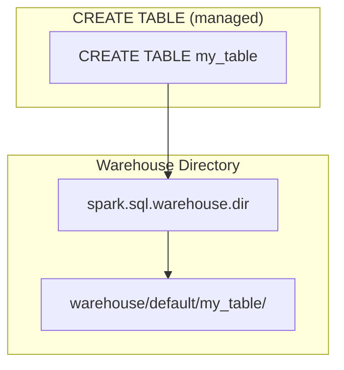

# Spark Warehouse Directory

The `spark.sql.warehouse.dir` configuration specifies where Spark SQL stores data for
**managed tables**. Understanding this setting is essential for controlling data placement.

---

## How It Works



When you create a managed table without an explicit `LOCATION`, Spark stores the data under
the warehouse directory following the pattern:

```text
<warehouse_dir>/<database>/<table>/
```

---

## Configuration

| Property                        | Default             | Description                                        |
|---------------------------------|---------------------|----------------------------------------------------|
| `spark.sql.warehouse.dir`       | `./spark-warehouse` | Root directory for managed table data               |
| `hive.metastore.warehouse.dir`  | `/user/hive/warehouse` | Hive-compatible equivalent (used by Hive metastore) |

!!! warning
    If `spark.sql.warehouse.dir` is not set explicitly, it defaults to `./spark-warehouse`
    **relative to the current working directory** — this can cause confusion when the CWD
    changes between runs.

---

## SparkSession Setup

From [`src/warehouse/spark_warehouse.py`](../../src/warehouse/spark_warehouse.py):

```python
import os
from pyspark.sql import SparkSession

warehouse_location = os.environ.get("SPARK_WAREHOUSE", "spark-warehouse")  # (1)!

spark = (
    SparkSession.builder
    .appName("WarehouseExample")
    .config("spark.sql.warehouse.dir", warehouse_location)  # (2)!
    .getOrCreate()
)

# Verify the active warehouse directory
print(f"Warehouse directory: {spark.conf.get('spark.sql.warehouse.dir')}")  # (3)!
```

1. Read the warehouse path from an environment variable with a sensible fallback.
2. Explicitly set the warehouse directory so Spark does not rely on CWD defaults.
3. Always verify the resolved value — especially in shared or cluster environments.

---

## Managed vs External Tables

### Managed Tables

Data is stored **inside** the warehouse directory. Dropping the table **deletes the data**.

```sql
-- Managed table (data written to warehouse dir)
CREATE TABLE default.managed_table (
    id   INT,
    name STRING
);
```

### External Tables

Data lives at a user-specified `LOCATION`. Dropping the table **only removes metadata**;
the data remains on disk.

```sql
-- External table (data at an explicit path)
CREATE TABLE default.external_table (
    id   INT,
    name STRING
)
USING PARQUET
LOCATION '/data/external/my_table';
```

### What Happens on `DROP TABLE`

| Table Type | Metadata | Data                              |
|------------|----------|-----------------------------------|
| Managed    | Deleted  | **Deleted** from warehouse dir    |
| External   | Deleted  | **Retained** at `LOCATION` path   |

---

## Common Warehouse Locations

| Environment | Typical Value                                                 |
|-------------|---------------------------------------------------------------|
| Local dev   | `./spark-warehouse` or `/tmp/spark-warehouse`                 |
| HDFS        | `hdfs://namenode:8020/user/hive/warehouse`                    |
| S3          | `s3://my-bucket/warehouse`                                    |
| ADLS        | `abfss://container@account.dfs.core.windows.net/warehouse`    |

---

## Verifying the Warehouse Directory

```python
# At runtime — confirm the resolved path
print(spark.conf.get("spark.sql.warehouse.dir"))
```

```sql
-- Via SQL
SET spark.sql.warehouse.dir;
```

---

## When to Use

!!! success "Good fit"
    - Controlling **data placement** for managed tables in local, HDFS, or cloud storage.
    - Ensuring consistent storage paths across development, staging, and production.

!!! tip
    Always set `spark.sql.warehouse.dir` **explicitly** in production to avoid relying on
    CWD-relative defaults. Use environment variables or configuration files to manage the
    path across environments.
