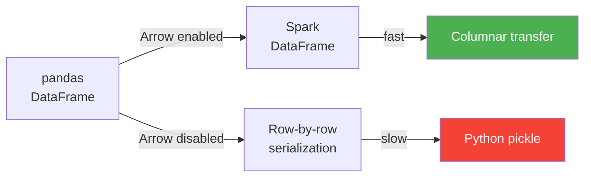

# Arrow Optimization

Apache Arrow enables **zero-copy columnar transfer** between pandas and Spark,
dramatically improving the performance of `toPandas()` and `createDataFrame(pdf)`.

## Why Arrow Matters



Without Arrow, Spark serialises each row individually through Python's pickle
protocol. With Arrow, entire columns are transferred in a single columnar batch.

## Enable Arrow

```python
spark = (SparkSession.builder
         .appName("arrow-optimization")
         .master(os.environ.get("SPARK_MASTER", "local[*]"))
         .config("spark.sql.execution.arrow.pyspark.enabled", "true")  # (1)!
         .getOrCreate())
```

1. This single config unlocks Arrow for both `toPandas()` and `createDataFrame()`.

Or set it at runtime:

```python
spark.conf.set("spark.sql.execution.arrow.pyspark.enabled", "true")
```

## Benchmark Example

```python title="src/spp/arrow_optimization/arrow_optimization.py"
--8<-- "src/spp/arrow_optimization/arrow_optimization.py"
```

### Run

```bash
python src/spp/arrow_optimization/arrow_optimization.py
```

## Configuration Reference

| Config | Default | Description |
|--------|---------|-------------|
| `spark.sql.execution.arrow.pyspark.enabled` | `false` | Enable Arrow for `toPandas()` / `createDataFrame()` |
| `spark.sql.execution.arrow.pyspark.fallback.enabled` | `true` | Fall back to non-Arrow if Arrow conversion fails |
| `spark.sql.execution.arrow.maxRecordsPerBatch` | `10000` | Max rows per Arrow batch |

!!! success "When to use"
    - Any call to `df.toPandas()` or `spark.createDataFrame(pdf)`
    - Pandas UDFs (Arrow is used automatically)
    - Large DataFrames where transfer time is significant

!!! failure "Limitations"
    - Requires `pyarrow >= 4.0.0` installed
    - Some complex nested types may not be supported
    - `MapType` with non-string keys requires Arrow ≥ 2.0
