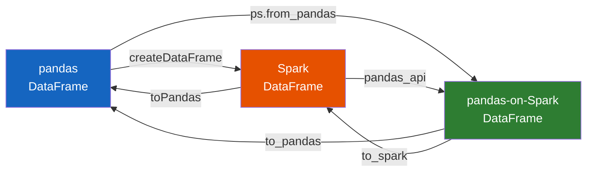

# DataFrame Interop

Convert between **pandas DataFrames** and **Spark DataFrames** using
Arrow-optimized transfers.

## Conversion Paths



| From | To | Method |
|------|------|--------|
| pandas | Spark | `spark.createDataFrame(pdf)` |
| Spark | pandas | `df.toPandas()` |
| pandas | pandas-on-Spark | `ps.from_pandas(pdf)` |
| pandas-on-Spark | pandas | `psdf.to_pandas()` |
| Spark | pandas-on-Spark | `df.pandas_api()` |
| pandas-on-Spark | Spark | `psdf.to_spark()` |

## Full Example

```python title="src/spp/dataframe/pandas_dataframe.py"
--8<-- "src/spp/dataframe/pandas_dataframe.py"
```

### Run

```bash
python src/spp/dataframe/pandas_dataframe.py
```

## Three-Way Conversion

```python title="src/spp/pandas_on_spark/conversion/dataframe_to_pandas.py"
--8<-- "src/spp/pandas_on_spark/conversion/dataframe_to_pandas.py"
```

### Run

```bash
python src/spp/pandas_on_spark/conversion/dataframe_to_pandas.py
```

!!! tip "Always enable Arrow"
    Set `spark.sql.execution.arrow.pyspark.enabled` to `true` before calling
    `toPandas()` or `createDataFrame()` with a pandas DataFrame.

!!! warning "Driver memory"
    `toPandas()` collects the entire DataFrame to the driver. Only use it on
    DataFrames that fit in driver memory.
