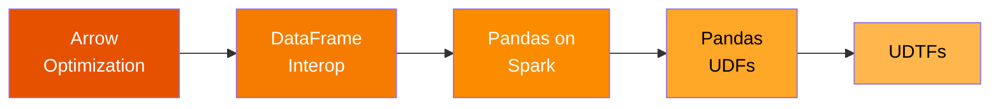

# PySpark Pandas

A **complete reference for PySpark's pandas integration** — the Pandas API on
Spark, pandas UDFs, Arrow optimization, and User-Defined Table Functions (UDTFs).
Every example is self-contained and runnable locally with `local[*]`.

## What You Will Learn



| Topic | What It Covers |
|-------|---------------|
| **Arrow Optimization** | Enable Arrow for fast pandas ↔ Spark transfer, benchmark comparison |
| **DataFrame Interop** | `createDataFrame(pdf)`, `toPandas()`, schema inspection |
| **Pandas on Spark** | `pyspark.pandas` — DataFrame creation, operations, grouping, options |
| **Pandas UDFs** | Vectorized UDFs — Series→Series, grouped aggregate, iterator |
| **UDTFs** | User-Defined Table Functions — basic, stateful, SQL, table arguments |

## Quick Start

=== "pip"
    ```bash
    pip install pyspark==3.5.1 pandas pyarrow
    ```

=== "conda"
    ```bash
    conda install -c conda-forge pyspark=3.5.1 pandas pyarrow
    ```

=== "uv"
    ```bash
    uv add pyspark pandas pyarrow
    ```

```bash
cd spark-python/pyspark-pandas
python src/spp/pyspark_pandas.py
```

!!! tip "No cluster needed"
    Every script runs on your laptop with `SPARK_MASTER=local[*]` — the default
    when no environment variable is set.

!!! warning "Java required"
    Java 11 must be on your `PATH`. Check with `java -version`.

## Project Layout

```text
pyspark-pandas/
├── src/spp/
│   ├── pyspark_pandas.py            # Entry-point overview
│   ├── arrow_optimization/          # Arrow benchmark
│   ├── dataframe/                   # pandas ↔ Spark interop
│   ├── pandas_on_spark/             # Pandas API on Spark
│   │   └── conversion/              # Three-way conversion
│   ├── pandas_udf/                  # Vectorized UDFs
│   └── udtf/                        # User-Defined Table Functions
├── tests/
├── notebooks/                       # Jupyter notebooks
├── docs/                            # This documentation
└── mkdocs.yml
```

## SparkSession Pattern

All scripts in this project follow the same session pattern:

1. Falls back to local mode when no `SPARK_MASTER` is set.
2. Enables Arrow for all pandas interop — critical for performance.

```python
import os
from pyspark.sql import SparkSession

spark = (SparkSession.builder
         .appName("descriptive-job-name")
         .master(os.environ.get("SPARK_MASTER", "local[*]"))     # (1)!
         .config("spark.sql.adaptive.enabled", "true")
         .config("spark.sql.adaptive.coalescePartitions.enabled", "true")
         .config("spark.sql.execution.arrow.pyspark.enabled", "true")  # (2)!
         .getOrCreate())
spark.sparkContext.setLogLevel("WARN")
```
