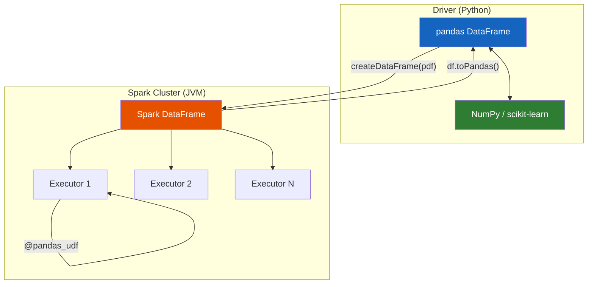
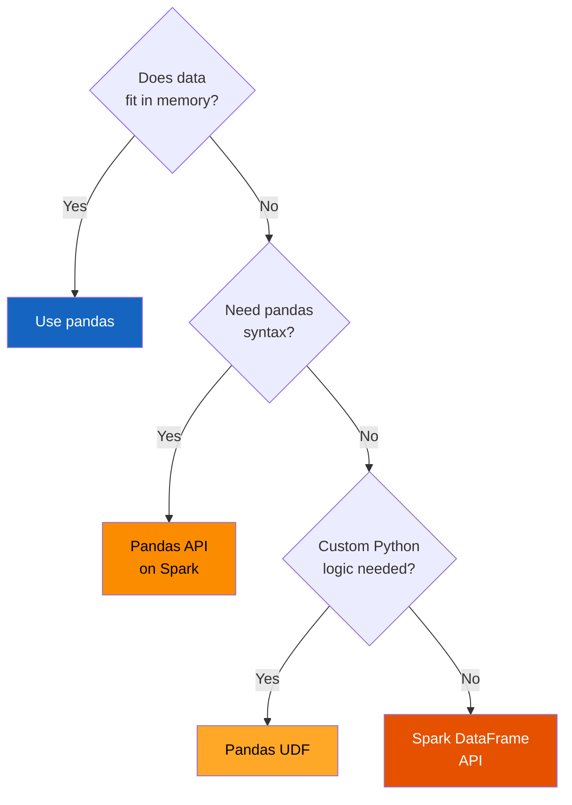

# Pandas–PySpark Integration

In PySpark 3.x, integration with pandas became much tighter and more powerful,
thanks to **Apache Arrow** and the **Pandas API on Spark**. PySpark doesn't
replace pandas — it *extends* it to big data.

## Architecture



!!! tip "Apache Arrow is the bridge"
    Arrow enables **zero-copy columnar transfer** between the JVM and Python.
    Always enable it: `spark.sql.execution.arrow.pyspark.enabled = "true"`.

## Four Integration Patterns

| # | Pattern | API | When to Use |
|---|---------|-----|-------------|
| 1 | [Spark → pandas](patterns.md#pattern-1-spark-pandas) | `df.toPandas()` | Small results for plotting / local analysis |
| 2 | [pandas → Spark](patterns.md#pattern-2-pandas-spark) | `spark.createDataFrame(pdf)` | Scale up local data for distributed processing |
| 3 | [Pandas UDF](patterns.md#pattern-3-pandas-udf-inside-spark) | `@pandas_udf` | Custom Python logic with vectorized performance |
| 4 | [Pandas API on Spark](patterns.md#pattern-4-pandas-api-on-spark) | `pyspark.pandas` | Familiar pandas syntax on big data |

## Pandas Function APIs

PySpark 3.0+ provides three pandas function APIs for distributed operations
on `pd.DataFrame` batches:

| API | Input | Output | Use Case |
|-----|-------|--------|----------|
| [`mapInPandas`](../pandas_udf/map_in_pandas.md) | `Iterator[pd.DataFrame]` | `Iterator[pd.DataFrame]` | General row-wise transforms |
| [`applyInPandas`](../pandas_udf/grouped_map.md) | `pd.DataFrame` (per group) | `pd.DataFrame` | Group-wise operations |
| [`cogroup`](../pandas_udf/cogroup.md) | Two `pd.DataFrame`s | `pd.DataFrame` | Joining grouped data |

See [Pandas Function APIs](pandas_function_apis.md) for a combined example.

## Real-World Use Cases

| Use Case | Pattern | Example |
|----------|---------|---------|
| [Feature engineering](use_cases.md#feature-engineering) | Spark agg → pandas | Joins & aggregations → correlation analysis |
| [ML pipelines](use_cases.md#ml-pipelines) | Spark prep → pandas train | Feature prep in Spark, model training in NumPy |
| [Custom transforms](use_cases.md#custom-transformations) | Pandas UDF | Time-series, NLP, statistical calculations |
| [Large-scale analysis](use_cases.md#large-scale-analysis) | Pandas API on Spark | `psdf.groupby().mean()` on terabyte data |
| [Hybrid workflows](use_cases.md#hybrid-workflows) | All four | Batch ETL + sampling + debugging + visualization |

## Quick Decision Guide



See [Best Practices](best_practices.md) for the full decision table and common
pitfalls.

## Prerequisites

=== "pip"
    ```bash
    pip install pyspark==3.5.1 pandas pyarrow numpy
    ```

=== "conda"
    ```bash
    conda install -c conda-forge pyspark=3.5.1 pandas pyarrow numpy
    ```

=== "uv"
    ```bash
    uv add pyspark pandas pyarrow numpy
    ```

!!! warning "Java required"
    Java 11 must be on your `PATH`. Check with `java -version`.

## Run All Patterns

```bash
python src/spp/integration/conversion_patterns.py
python src/spp/integration/feature_engineering.py
python src/spp/integration/ml_pipeline.py
python src/spp/integration/hybrid_workflow.py
```
