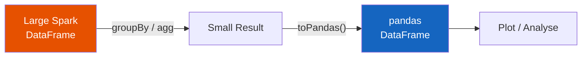
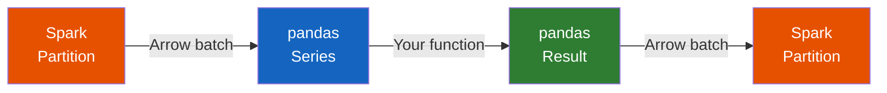

# Integration Patterns

Four core patterns for bridging pandas and PySpark 3.x. Each pattern targets a
different data size and use case.

## Pattern 1: Spark → pandas

Pull a **small** Spark result to pandas for local analysis, plotting, or ML input.



```python
# Aggregate in Spark, pull compact result to pandas
summary = df.groupBy("region").agg(
    F.sum("revenue").alias("total_revenue"),
    F.count("name").alias("headcount"),
)
pdf = summary.toPandas()  # (1)!
```
1. Arrow-optimized — fast columnar transfer when `arrow.pyspark.enabled` is `true`.

!!! success "When to use"
    - Dataset **fits in driver memory** after aggregation
    - You need matplotlib / seaborn plotting
    - ML model input (scikit-learn, XGBoost)

!!! failure "When NOT to use"
    - Raw data has millions of rows — **will crash the driver**
    - You just need `count()` or `show()` — no conversion needed

---

## Pattern 2: pandas → Spark

Push **local data** to Spark for distributed processing.

```python
import pandas as pd

pdf = pd.DataFrame({
    "user_id": range(1, 6),
    "plan": ["free", "pro", "free", "enterprise", "pro"],
})

df = spark.createDataFrame(pdf)  # (1)!
df.show()
```
1. Uses Arrow under the hood when enabled — much faster than row-by-row pickle.

!!! success "When to use"
    - Starting from local CSV, API response, or test fixture
    - Need to join small reference data with a large Spark table

!!! failure "When NOT to use"
    - Data is already in HDFS / S3 / Delta — read it directly with `spark.read`

---

## Pattern 3: Pandas UDF inside Spark

Run **custom Python logic** on Spark partitions with vectorized performance.



```python
from pyspark.sql.functions import pandas_udf
from pyspark.sql.types import DoubleType

@pandas_udf(DoubleType())
def normalize(s: pd.Series) -> pd.Series:
    return (s - s.mean()) / s.std()

result = df.withColumn("normalized", normalize("value"))
```

!!! success "When to use"
    - Custom logic not available as built-in Spark functions
    - Time-series transforms, NLP preprocessing, statistical calculations
    - ML model scoring per partition

!!! failure "When NOT to use"
    - Simple operations like `upper()`, `round()`, `concat()` — built-ins are faster
    - Aggregations already supported by `F.sum()`, `F.avg()`, etc.

---

## Pattern 4: Pandas API on Spark

Write **pandas-like code** that runs on the Spark cluster.

```python
import pyspark.pandas as ps

psdf = ps.DataFrame({
    "category": ["A", "B", "A", "C", "B", "A"],
    "amount": [100, 200, 150, 300, 250, 175],
})

# Familiar pandas syntax → executes on Spark
print(psdf.groupby("category").mean())

# Convert to Spark when needed
sdf = psdf.to_spark()
```

!!! success "When to use"
    - Analysts transitioning from pandas who want familiar syntax
    - Large-scale data analysis with `groupby()`, `merge()`, `pivot_table()`
    - Rapid prototyping before moving to Spark DataFrame API

!!! failure "When NOT to use"
    - Performance-critical pipelines — native Spark API can be faster
    - Operations not yet supported by `pyspark.pandas`
    - Complex Spark-specific features (broadcast joins, bucketing)

---

## Full Example

```python title="src/spp/integration/conversion_patterns.py"
--8<-- "src/spp/integration/conversion_patterns.py"
```

### Run

```bash
python src/spp/integration/conversion_patterns.py
```
