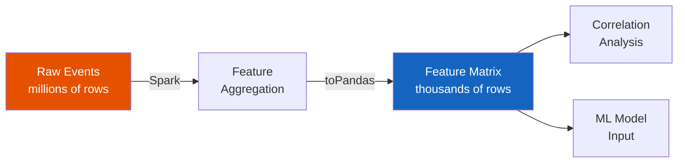
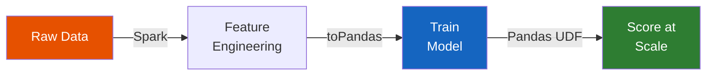
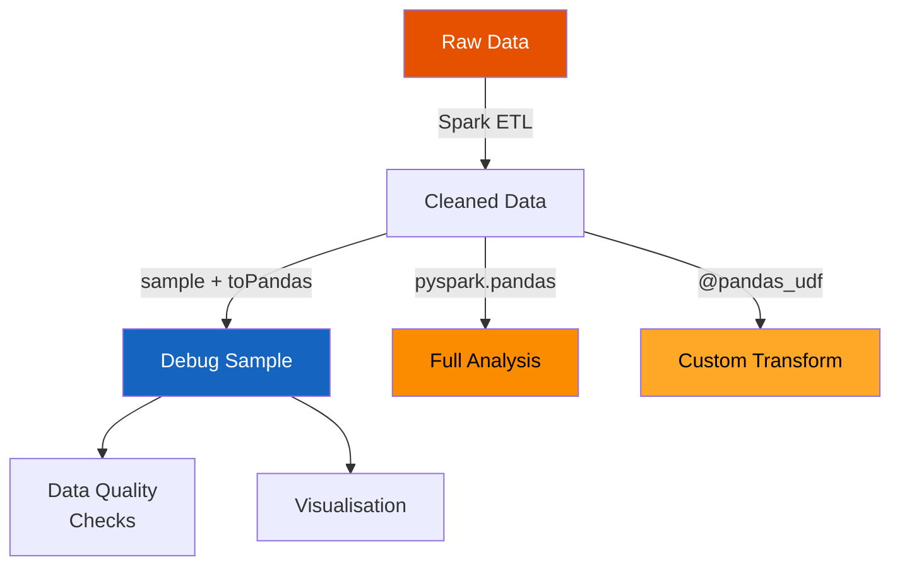

# Real-World Use Cases

Practical examples of how pandas and PySpark work together in production
pipelines. Each use case maps to one or more [integration patterns](patterns.md).

## Feature Engineering

**Pattern:** Spark aggregations → pandas for analysis

Use Spark for large-scale joins and aggregations, then pull the compact feature
matrix to pandas for correlation analysis, feature selection, and ML input.



```python
# Spark: aggregate features at user level
user_features = orders.groupBy("user_id").agg(
    F.count("order_id").alias("order_count"),
    F.round(F.sum("amount"), 2).alias("total_spend"),
    F.round(F.avg("amount"), 2).alias("avg_order_value"),
)

# pandas: inspect and analyse
pdf = user_features.toPandas()
print(pdf[["order_count", "total_spend"]].corr())
```

```python title="src/spp/integration/feature_engineering.py"
--8<-- "src/spp/integration/feature_engineering.py"
```

### Run

```bash
python src/spp/integration/feature_engineering.py
```

---

## ML Pipelines

**Pattern:** Spark prep → pandas/NumPy training → Spark scoring

Feature preparation happens in Spark (distributed), model training in
pandas/NumPy (driver), and scoring goes back to Spark via a Pandas UDF.



```python
# Step 1: Feature engineering in Spark
features_df = raw_df.withColumn("feature_b_log", F.log1p("feature_b"))

# Step 2: Train in pandas/NumPy
pdf = features_df.toPandas()
weights = np.linalg.lstsq(X_train, y_train, rcond=None)[0]

# Step 3: Score back in Spark with Pandas UDF
@pandas_udf(DoubleType())
def predict(feat_a: pd.Series, feat_b: pd.Series) -> pd.Series:
    w = broadcast_weights.value
    X = np.column_stack([feat_a, feat_b])
    return pd.Series(X @ w)

scored = features_df.withColumn("prediction", predict("feature_a", "feature_b"))
```

```python title="src/spp/integration/ml_pipeline.py"
--8<-- "src/spp/integration/ml_pipeline.py"
```

### Run

```bash
python src/spp/integration/ml_pipeline.py
```

---

## Custom Transformations

**Pattern:** Pandas UDF for complex per-partition logic

When Spark SQL doesn't have a built-in function, use `@pandas_udf` for
vectorized execution across partitions.

**Common scenarios:**

- **Time-series transformations** — rolling averages, exponential smoothing
- **Statistical calculations** — custom percentiles, z-scores, distribution fits
- **NLP preprocessing** — tokenization, text cleaning, regex extraction
- **ML model scoring** — apply a pre-trained model per batch

```python
@pandas_udf(StringType())
def classify_amount(amount: pd.Series) -> pd.Series:
    bins = [0, 25, 75, 150, float("inf")]
    labels = ["micro", "small", "medium", "large"]
    return pd.cut(amount, bins=bins, labels=labels).astype(str)

df.withColumn("tier", classify_amount("amount")).show()
```

---

## Large-Scale Analysis

**Pattern:** Pandas API on Spark for familiar syntax at scale

Use `pyspark.pandas` when you want the pandas API but your data doesn't fit in
memory.

```python
import pyspark.pandas as ps

psdf = ps.read_parquet("s3://warehouse/events/")

# Pandas syntax, Spark execution
summary = psdf.groupby("category")["amount"].agg(["mean", "sum", "count"])
print(summary.sort_values("sum", ascending=False))
```

!!! tip "Great for"
    - Analysts transitioning from pandas
    - Exploratory data analysis on large datasets
    - Rapid prototyping before optimizing with Spark API

---

## Group Feature Engineering

**Pattern:** `applyInPandas` for rolling / lag / cumulative stats per entity

Use `groupBy().applyInPandas()` to apply pandas time-series operations
within each group — rolling windows, lag features, cumulative sums.

```python
def engineer_features(pdf: pd.DataFrame) -> pd.DataFrame:
    pdf = pdf.sort_values("ts").copy()
    pdf["rolling_mean_3"] = pdf["value"].rolling(window=3, min_periods=1).mean()
    pdf["lag_1"] = pdf["value"].shift(1)
    pdf["cumsum"] = pdf["value"].cumsum()
    return pdf

df.groupBy("entity_id").applyInPandas(engineer_features, schema=FEATURE_SCHEMA)
```

### Run

```bash
python src/spp/integration/group_feature_engineering.py
```

---

## ML Preprocessing

**Pattern:** `applyInPandas` for per-group fillna / outlier removal / scaling

Common ML preprocessing steps applied per group using `applyInPandas`:
missing value imputation (group median), outlier removal (sigma rule),
and min-max scaling.

```python
def full_preprocess(pdf: pd.DataFrame) -> pd.DataFrame:
    pdf = pdf.copy()
    for col in ["feature_a", "feature_b"]:
        pdf[col] = pdf[col].fillna(pdf[col].median())
    mean, std = pdf["feature_a"].mean(), pdf["feature_a"].std() or 1.0
    pdf = pdf[(pdf["feature_a"] - mean).abs() / std < 3]
    fmin, fmax = pdf["feature_a"].min(), pdf["feature_a"].max()
    pdf["scaled_a"] = (pdf["feature_a"] - fmin) / (fmax - fmin or 1.0)
    return pdf
```

!!! warning "Memory"
    All data for a group is loaded into the executor's memory.
    Ensure groups aren't too large to avoid OOM errors.

### Run

```bash
python src/spp/integration/ml_preprocessing.py
```

---

## Hybrid Workflows

**Pattern:** Batch ETL + sampling + debugging + visualization

The most common production pattern combines all four integration approaches:



1. **Batch ETL** — clean, enrich, aggregate with Spark DataFrames
2. **Sample & debug** — pull 1–10% to pandas for null checks, distributions
3. **Full analysis** — use Pandas API on Spark for groupby summaries
4. **Custom transform** — `@pandas_udf` for binning, labelling, scoring

```python title="src/spp/integration/hybrid_workflow.py"
--8<-- "src/spp/integration/hybrid_workflow.py"
```

### Run

```bash
python src/spp/integration/hybrid_workflow.py
```
