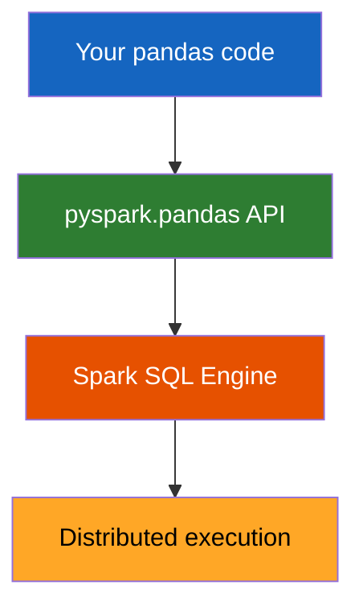

# Pandas API on Spark

The **Pandas API on Spark** (`pyspark.pandas`) lets you write pandas code that
runs on Spark's distributed engine — combine pandas familiarity with Spark scale.



## Key Benefits

- **Familiar API** — use `DataFrame`, `Series`, `groupby`, `apply` just like pandas
- **Distributed** — runs on Spark, scales beyond single-machine memory
- **Interoperable** — convert to/from Spark and pandas DataFrames freely

## Import Convention

```python
import pyspark.pandas as ps  # always alias as ps
```

## Topics

| Page | Description |
|------|-------------|
| [DataFrame](dataframe.md) | Create and manipulate pandas-on-Spark DataFrames |
| [Cross-Frame Ops](ops_diff_frames.md) | Arithmetic between DataFrames from different sources |
| [Options](options.md) | Control display and compute behaviour |
| [Conversion](conversion.md) | Convert between pandas, Spark, and pandas-on-Spark |

!!! success "Good fit"
    - Teams already using pandas who need to scale to big data
    - Exploratory analysis on large datasets
    - Prototyping before moving to the Spark DataFrame API

!!! failure "Not a good fit"
    - Workloads that need fine-grained Spark SQL optimizations
    - UDF-heavy workflows (use pandas UDFs instead)
