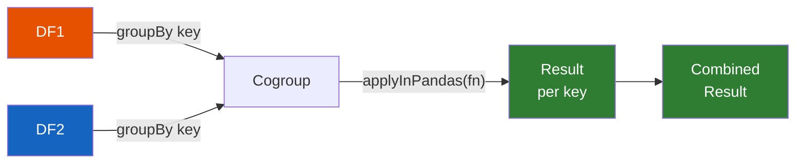

# Cogrouped Map

Join two DataFrames by key and apply pandas logic to each paired group.
Available since **Spark 3.0.0**.

`cogroup().applyInPandas()` groups two DataFrames by the same key, pairs up
matching groups, and sends both as `pd.DataFrame` arguments to your function.
This enables complex join logic that would be difficult with Spark SQL alone.

## How It Works



## Example — Merge Scores

```python
import pandas as pd

def merge_scores(pdf1: pd.DataFrame, pdf2: pd.DataFrame) -> pd.DataFrame:
    return pd.merge(pdf1, pdf2, on="student_id", how="inner")

result = (
    grades.groupBy("student_id")
    .cogroup(attendance.groupBy("student_id"))
    .applyInPandas(merge_scores, schema=output_schema)
)
```

## Example — As-of Match

For time-series use cases, `pd.merge_asof` pairs records by the nearest
timestamp within each group:

```python
def asof_match(trades: pd.DataFrame, quotes: pd.DataFrame) -> pd.DataFrame:
    trades = trades.sort_values("timestamp")
    quotes = quotes.sort_values("timestamp")
    return pd.merge_asof(trades, quotes, on="timestamp", direction="backward")

result = (
    trades_df.groupBy("symbol")
    .cogroup(quotes_df.groupBy("symbol"))
    .applyInPandas(asof_match, schema=asof_schema)
)
```

!!! tip "As-of joins"
    `pd.merge_asof` is a powerful pandas API for matching the nearest value
    in time — perfect for joining trades with quotes, events with snapshots,
    or sensor readings with reference data.

!!! warning "Data skew"
    If one key has far more rows in one DataFrame than the other, that
    executor will use disproportionate memory and time. Consider:

    - Checking group sizes in both DataFrames before applying
    - Repartitioning or salting highly skewed keys
    - Filtering out large groups for separate processing

    ```python
    # Check for skew
    df1.groupBy("key").count().orderBy(F.desc("count")).show(5)
    df2.groupBy("key").count().orderBy(F.desc("count")).show(5)
    ```

## Use Cases

!!! success "Good fit"
    - Complex joins that go beyond equi-join (as-of, range, fuzzy)
    - Cross-dataset enrichment per key
    - Time-series alignment between two sources
    - Comparing metrics from two systems per entity

!!! failure "Not a good fit"
    - Simple equi-joins — use `df1.join(df2, "key")`
    - Single-DataFrame operations — use [Grouped Map](grouped_map.md)
    - Operations that don't need grouping — use [mapInPandas](map_in_pandas.md)

## Run

```bash
python src/spp/pandas_udf/cogroup_udf.py
```

## Configuration

| Config | Default | Description |
|--------|---------|-------------|
| `spark.sql.shuffle.partitions` | `200` | Number of partitions after `groupBy` shuffle |
| `spark.sql.execution.arrow.maxRecordsPerBatch` | `10000` | Rows per Arrow batch |

## Full Example

```python title="src/spp/pandas_udf/cogroup_udf.py"
--8<-- "src/spp/pandas_udf/cogroup_udf.py"
```
