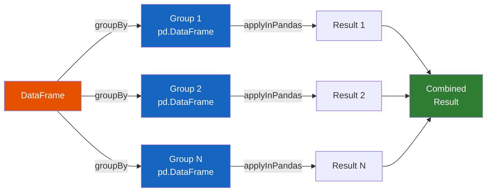

# Grouped Map (applyInPandas)

Split-apply-combine pattern for per-group pandas operations. Available since
**Spark 3.0.0**.

`groupBy().applyInPandas()` splits a Spark DataFrame into groups, sends each
group to your function as a `pd.DataFrame`, and combines the results back
into a single Spark DataFrame.

## How It Works



## Example — Normalize Within Group

```python
import pandas as pd

def normalize(pdf: pd.DataFrame) -> pd.DataFrame:
    pdf["normalized"] = (pdf["value"] - pdf["value"].mean()) / pdf["value"].std()
    return pdf

result = df.groupBy("category").applyInPandas(
    normalize,
    schema="category string, id int, value double, normalized double",
)
```

## Group Key Access

Your function can optionally receive the group key as the first argument:

```python
def mean_with_key(key, pdf: pd.DataFrame) -> pd.DataFrame:
    category = key[0]  # (1)!
    pdf["group_mean"] = pdf["value"].mean()
    pdf["group_label"] = category
    return pdf
```
1. `key` is a tuple of the group-by column values.

!!! warning "Memory"
    **All data for a group** is loaded into a single executor's memory.
    Ensure groups aren't too large to avoid OOM errors. Check group sizes
    before applying:

    ```python
    df.groupBy("category").count().orderBy(F.desc("count")).show(5)
    ```

## Use Cases

!!! success "Good fit"
    - Per-group statistics (z-scores, percentiles, custom aggregations)
    - Within-group normalization or standardization
    - Time-series analysis per entity (rolling windows, lag features)
    - Anomaly detection per group

!!! failure "Not a good fit"
    - Element-wise transforms — use a [Series UDF](series.md)
    - Operations that don't need grouping — use [mapInPandas](map_in_pandas.md)
    - Simple aggregations (`sum`, `mean`) — use `F.sum()`, `F.avg()`

## Run

```bash
python src/spp/pandas_udf/grouped_map_udf.py
```

## Configuration

| Config | Default | Description |
|--------|---------|-------------|
| `spark.sql.shuffle.partitions` | `200` | Number of partitions after `groupBy` shuffle |
| `spark.sql.execution.arrow.maxRecordsPerBatch` | `10000` | Rows per Arrow batch |

## Full Example

```python title="src/spp/pandas_udf/grouped_map_udf.py"
--8<-- "src/spp/pandas_udf/grouped_map_udf.py"
```
