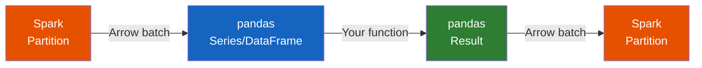

# Pandas UDFs

**Pandas UDFs** (vectorized UDFs) use Apache Arrow to transfer data and pandas
for computation, giving **10–100× speedup** over row-at-a-time Python UDFs.



## UDF Types

| Type | Signature | Use Case |
|------|-----------|----------|
| [Series → Series](series.md) | `pd.Series → pd.Series` | Element-wise transforms |
| [Grouped Aggregate](aggregate.md) | `pd.Series → scalar` | Custom aggregations |
| [Iterator](iterator.md) | `Iterator[pd.Series] → Iterator[pd.Series]` | Stateful / batched transforms |
| [mapInPandas](map_in_pandas.md) | `Iterator[pd.DataFrame] → Iterator[pd.DataFrame]` | General batch-wise transforms |
| [Grouped Map](grouped_map.md) | `pd.DataFrame → pd.DataFrame` (per group) | Per-group operations |
| [Cogrouped Map](cogroup.md) | `(pd.DataFrame, pd.DataFrame) → pd.DataFrame` | Cross-dataset grouped joins |

## Decorator Pattern

```python
from pyspark.sql.functions import pandas_udf
from pyspark.sql.types import DoubleType

@pandas_udf(DoubleType())
def my_udf(s: pd.Series) -> pd.Series:
    return s * 2
```

!!! tip "Arrow is automatic"
    Pandas UDFs automatically use Arrow — you do not need to enable
    `spark.sql.execution.arrow.pyspark.enabled` separately.

!!! success "When to use"
    - Element-wise transforms (string ops, math, parsing)
    - Custom aggregations not available as built-in functions
    - ML model scoring per partition

!!! failure "When NOT to use"
    - Simple operations available as `F.col()` expressions — built-ins are faster
    - Operations that need Spark SQL optimizer pushdown
