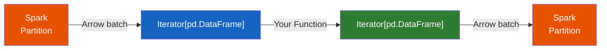

# mapInPandas

General-purpose batch-wise transformation that applies a Python function to
each partition of a Spark DataFrame as a `pd.DataFrame`. Available since
**Spark 3.0.0**.

Unlike Pandas UDFs which operate on individual columns (`pd.Series`),
`mapInPandas` receives the **entire partition** as a `pd.DataFrame`, giving
you full access to every column at once.

## How It Works



## Example — Adding a Derived Column

```python
from typing import Iterator
import pandas as pd

def add_double_age(iterator: Iterator[pd.DataFrame]) -> Iterator[pd.DataFrame]:
    for pdf in iterator:
        pdf["double_age"] = pdf["age"] * 2
        yield pdf

result = df.mapInPandas(add_double_age, schema="name string, age int, double_age int")
result.show()
```

!!! tip "Iterator pattern"
    `mapInPandas` uses the **iterator-of-batches** pattern: your function
    receives `Iterator[pd.DataFrame]` and must yield `Iterator[pd.DataFrame]`.
    This keeps memory usage low — only one batch is in memory at a time.

## Use Cases

!!! success "Good fit"
    - Complex row-wise transforms that need access to multiple columns
    - Data cleaning pipelines (null filling, type conversion, regex extraction)
    - Feature engineering using pandas methods (`pd.cut`, rolling, string ops)
    - Applying a pre-trained ML model per batch

!!! failure "Not a good fit"
    - Simple single-column transforms — use a [Series UDF](series.md) instead
    - Aggregations per group — use [Grouped Map](grouped_map.md) instead
    - Operations available as Spark built-ins (`F.upper()`, `F.round()`)

## Run

```bash
python src/spp/pandas_udf/map_in_pandas.py
```

## Configuration

| Config | Default | Description |
|--------|---------|-------------|
| `spark.sql.execution.arrow.maxRecordsPerBatch` | `10000` | Rows per Arrow batch sent to the function |
| `spark.sql.execution.arrow.pyspark.enabled` | `false` | Enable Arrow optimization (auto-enabled for `mapInPandas`) |

## Full Example

```python title="src/spp/pandas_udf/map_in_pandas.py"
--8<-- "src/spp/pandas_udf/map_in_pandas.py"
```
