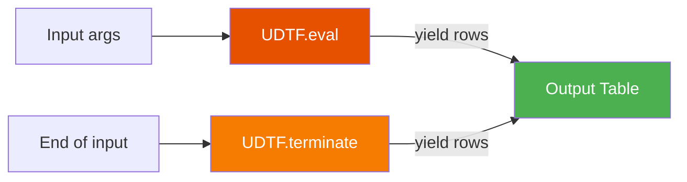

# User-Defined Table Functions (UDTFs)

Spark 3.5 introduces **Python UDTFs** — functions invoked in the `FROM` clause
that return an **entire table** rather than a single value.

## UDTF Lifecycle

| Method | Required | Called When |
|--------|----------|------------|
| `__init__` | No | Once per partition — initialize state |
| `eval` | Yes | Once per input row — yield zero or more output rows |
| `terminate` | No | After all rows consumed — yield final results |

## Topics

| Page | Description |
|------|-------------|
| [Basic UDTF](basic.md) | `@udtf` decorator, `udtf()` function |
| [Stateful UDTF](stateful.md) | Accumulate state in `eval()`, emit in `terminate()` |
| [Date Expander](date_expander.md) | Practical example — expand date ranges |
| [SQL Integration](sql.md) | Register UDTFs for Spark SQL, LATERAL joins |
| [Table Arguments](table_arguments.md) | Pass entire tables as UDTF input |

!!! success "Good fit"
    - Generating rows (date expansion, parameter sweep)
    - Custom aggregation with multi-row output
    - Row-level filtering with complex logic

!!! failure "Not a good fit"
    - Simple scalar transforms (use UDFs or built-in functions)
    - Operations already available in Spark SQL
