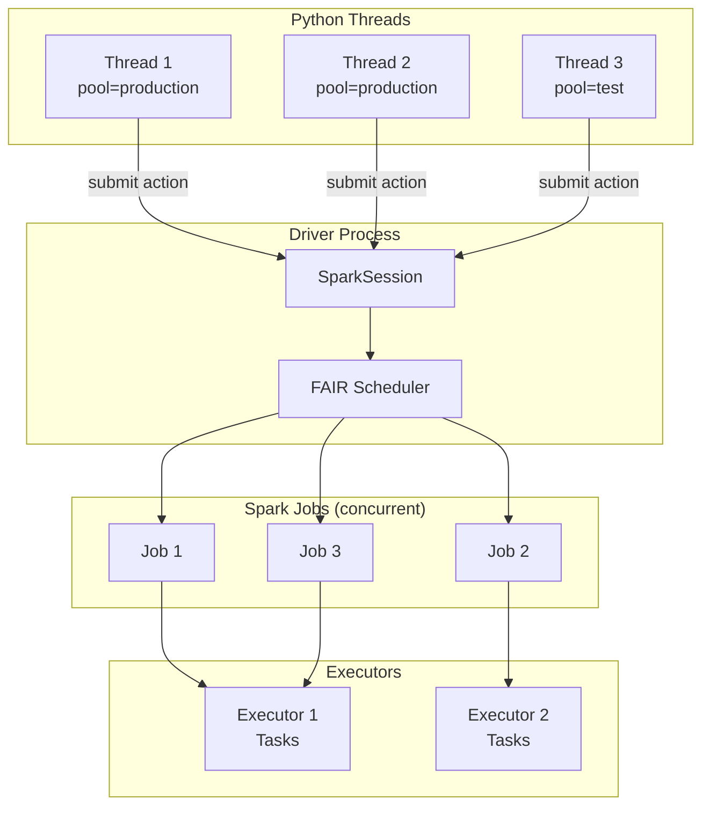
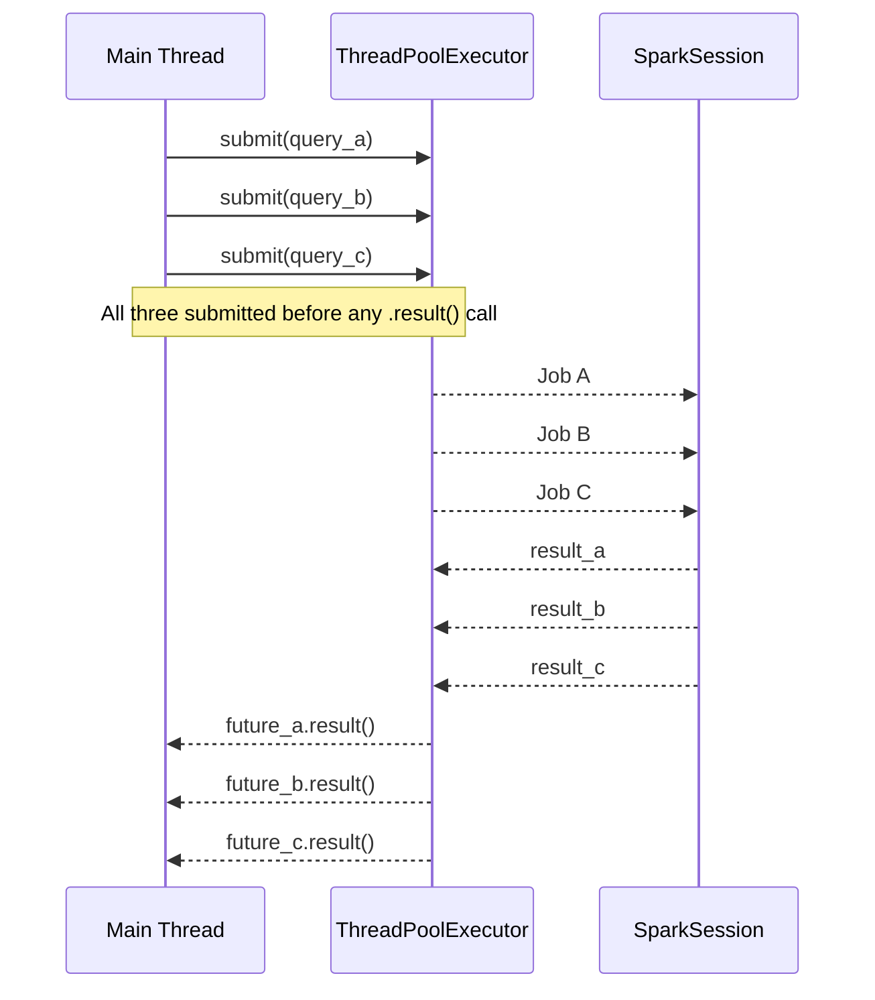
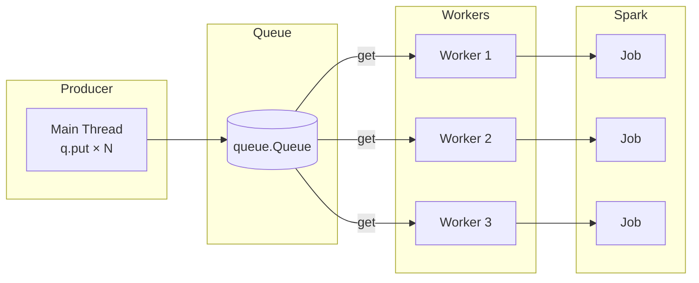

# MkDocs Documentation Instructions

## Theme & Config (`mkdocs.yml`)

Use MkDocs Material with the project's standard palette:

```yaml
site_name: PySpark Parallel Queries
site_description: Parallel execution patterns for PySpark applications
theme:
  name: material
  palette:
    - scheme: default
      primary: deep orange
      accent: orange
      toggle:
        icon: material/brightness-7
        name: Switch to dark mode
    - scheme: slate
      primary: deep orange
      accent: orange
      toggle:
        icon: material/brightness-4
        name: Switch to light mode
  features:
    - navigation.tabs
    - navigation.sections
    - navigation.expand
    - navigation.top
    - navigation.indexes
    - search.highlight
    - search.suggest
    - content.code.copy
    - content.code.annotate

plugins:
  - search
  - include-markdown

markdown_extensions:
  - admonition
  - attr_list
  - md_in_html
  - tables
  - pymdownx.details
  - pymdownx.inlinehilite
  - pymdownx.highlight:
      anchor_linenums: true
      line_spans: __span
      pygments_lang_class: true
  - pymdownx.superfences:
      custom_fences:
        - name: mermaid
          class: mermaid
          format: !!python/name:pymdownx.superfences.fence_code_format
  - pymdownx.tabbed:
      alternate_style: true
  - pymdownx.snippets:
      base_path: ["."]
  - toc:
      permalink: true
```

---

## Recommended Site Structure

```
docs/
├── index.md                         # Overview — why parallel, when to use which pattern
├── concepts.md                      # FAIR scheduler, thread safety, Python GIL vs JVM
├── patterns/
│   ├── threading.md                 # threading.Thread pattern
│   ├── threadpool.md                # multiprocessing.pool.ThreadPool
│   ├── futures.md                   # ThreadPoolExecutor + Python futures
│   ├── queue.md                     # Queue worker pool
│   ├── inheritable-thread.md        # InheritableThread + job cancellation
│   └── horizontal-parallelism.md   # Per-column parallel ops
├── scheduling/
│   ├── fair-scheduler.md            # FAIR mode + pool assignment
│   └── pool-config.md               # fairscheduler.xml reference
└── testing.md                       # How to test parallel Spark code
```

Register every new page under `nav:` in `mkdocs.yml`.

---

## Architecture Diagrams (Mermaid)

Every pattern page must include a diagram showing the parallelism structure.

### Parallel Jobs — FAIR Scheduler



### ThreadPoolExecutor Pattern



### Queue Worker Pool



---

## Pattern Page Template

Use this structure for every page under `docs/patterns/`:

```markdown
# Pattern Name

One-sentence description of what this pattern does and when to use it.

## How It Works

Short paragraph + architecture diagram (Mermaid).

## When to Use

!!! success "Good fit"
    - Independent Spark actions with no data dependency
    - Fan-out over a list of tables, regions, or files

!!! failure "Not suitable"
    - Jobs that depend on each other's output (use pipeline chaining instead)
    - More threads than available executor cores (diminishing returns)

## Code

```python title="src/parallel/<file>.py"
--8<-- "src/parallel/<file>.py"
```

## Run

```bash
SPARK_MASTER=local[*] python src/parallel/<file>.py
```

## Configuration Reference

| Config key | Default | Description |
| ---------- | ------- | ----------- |
| `spark.scheduler.mode` | `FIFO` | Set to `FAIR` for concurrent jobs |
| `spark.scheduler.pool` | `default` | Per-thread pool name (thread-local) |

## Key Points

- Bullet list of implementation rules for this specific pattern.
```

---

## Code Blocks

### Snippet include (preferred)

````markdown
```python title="src/parallel/concurrent/run_parallel_jobs.py"
--8<-- "src/parallel/concurrent/run_parallel_jobs.py"
```
````

### Tabbed install options

````markdown
=== "pip"
    ```bash
    pip install pyspark==3.5.0
    ```

=== "conda"
    ```bash
    conda install -c conda-forge pyspark=3.5.0
    ```

=== "uv"
    ```bash
    uv add pyspark
    ```
````

### Code annotations

```python
with ThreadPoolExecutor(max_workers=3) as executor:      # (1)!
    future_a = executor.submit(lambda: df1.count())      # (2)!
    future_b = executor.submit(lambda: df2.count())      # (2)!
    result_a = future_a.result()                         # (3)!
```
1. Pool of 3 worker threads — one per query.
2. Jobs submitted before any `.result()` call — all run concurrently.
3. Block here only when the value is actually needed.

---

## Admonitions

```markdown
!!! tip "One SparkSession, many threads"
    `SparkSession` is thread-safe — share one instance across all threads.
    Never create a new session per thread.

!!! warning "GIL does not block Spark"
    Python's GIL applies to pure-Python code, but Spark operations execute
    in the JVM and release the GIL. Real parallelism is achieved.

!!! note "FAIR scheduler required"
    Without FAIR mode, later jobs queue behind the first even if resources
    are available. Always set `spark.scheduler.mode = FAIR`.

!!! success "Good fit"
    - Reading from multiple independent data sources
    - Per-region or per-table batch processing
    - Column-independent statistical operations

!!! failure "Not a good fit"
    - Jobs that produce input for subsequent jobs (sequential pipeline)
    - More concurrent jobs than executor cores × threads per executor
```

---

## Building & Serving

```bash
mkdocs serve              # local dev server — http://127.0.0.1:8000
mkdocs build --strict     # production build — fails on warnings (CI)
```
