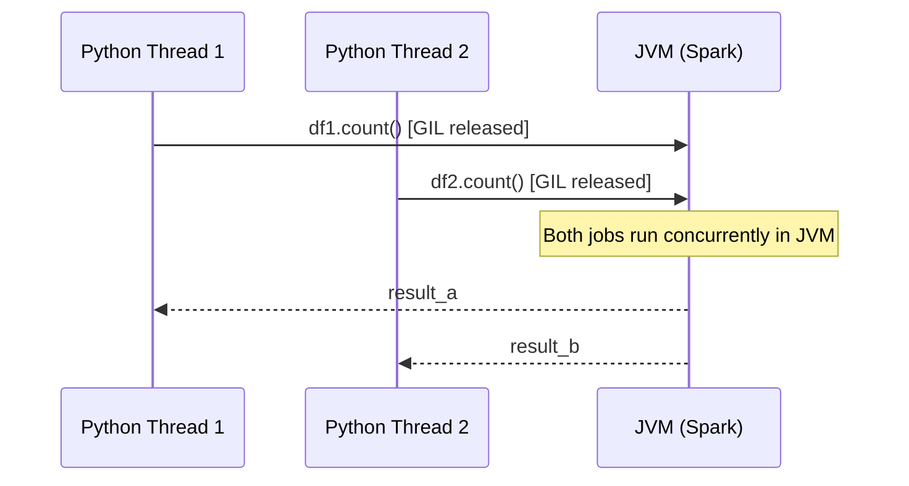
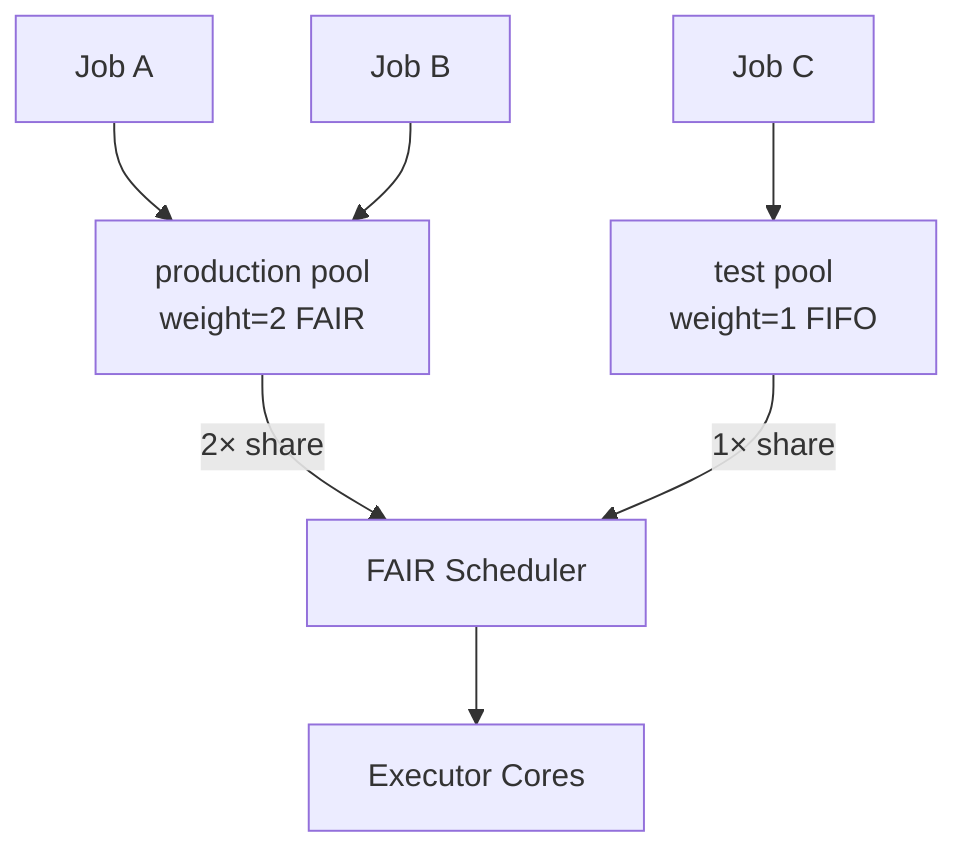

# Core Concepts

## The Default Problem: FIFO Scheduling

When you invoke a Spark action (`count`, `write`, `show`) inside a Python function,
Spark creates a **job**. By default, the scheduler processes jobs in **FIFO** order —
Job B cannot start until Job A has consumed all its executor slots.

```mermaid
gantt
    title FIFO — 3 jobs, 4 executor cores
    dateFormat  X
    axisFormat  %s s

    section Job A
    Stages  : 0, 4

    section Job B
    Waiting : crit, 0, 4
    Stages  : 4, 7

    section Job C
    Waiting : crit, 0, 7
    Stages  : 7, 9
```



If Job A only uses 2 of 4 available cores, the other 2 sit idle while Jobs B and C wait.

---

## The Solution: FAIR Scheduling + Threads

Two changes unlock true intra-application parallelism:

1. **Enable FAIR mode** — the scheduler interleaves tasks from all in-flight jobs in round-robin order.
2. **Submit jobs from separate threads** — each thread triggers a Spark action independently; `SparkSession` is thread-safe.

```mermaid
gantt
    title FAIR — 3 jobs, 4 executor cores
    dateFormat  X
    axisFormat  %s s

    section Job A
    Stages  : 0, 4

    section Job B
    Stages  : 0, 3

    section Job C
    Stages  : 0, 2
```



All three jobs share the 4 cores simultaneously and the application finishes earlier.

---

## Python GIL vs JVM Parallelism

Python has the **Global Interpreter Lock (GIL)**, which prevents two Python threads
from executing pure-Python bytecode simultaneously. This sounds like it would block
parallel Spark jobs — but it does not.

The reason: Spark operations execute in the **JVM**, not in Python. When a Python
thread calls `df.count()`, it:

1. Sends the action to the JVM via Py4J (Python → Java bridge).
2. Releases the GIL while waiting for the JVM response.
3. The JVM schedules and runs tasks on executor cores — completely outside the GIL.



!!! note "ThreadPool vs multiprocessing"
    Use `multiprocessing.pool.ThreadPool` (thread-based) for Spark parallelism —
    not `multiprocessing.Pool` (process-based). Multiple processes would each
    need their own JVM/SparkContext, which is far more expensive.

---

## Thread Safety

`SparkSession` and `SparkContext` are **fully thread-safe**. You can call any
DataFrame API method from multiple threads simultaneously without locks.

What you *do* need to protect is **Python-side shared state** — mutable data
structures your threads read and write:

| Shared resource | Thread-safe? | Fix |
| --------------- | ------------ | --- |
| `SparkSession` / `SparkContext` | ✅ Yes | No lock needed |
| `dict` / `list` result collector | ❌ No | Use `threading.Lock` |
| `queue.Queue` | ✅ Yes | No lock needed |
| Thread-local Spark properties | ✅ Yes | `setLocalProperty` writes to thread-local storage |

### Lock pattern for shared results

```python
from threading import Lock

results: dict = {}
lock = Lock()

def count_job(region: str) -> None:
    count = df.filter(F.col("region") == region).count()
    with lock:              # (1)!
        results[region] = count
```

1. The lock protects only the dict write — the expensive Spark action runs outside it.

---

## When Parallel Jobs Help vs Hurt

!!! success "Good fit"
    - Independent queries on the same or different DataFrames
    - Reading from multiple JDBC tables simultaneously
    - Per-column statistical operations (null counts, cardinality, dedup)
    - Fan-out batch processing (one job per region, date, or file)

!!! failure "Not a good fit"
    - Jobs that feed results into subsequent jobs (pipeline dependency)
    - More threads than available executor cores × executor count
    - Short jobs (< 1 s) where thread overhead exceeds the parallel benefit
    - Spark Streaming — use its native micro-batch parallelism instead

---

## Scheduler Pool Concepts

Named pools let you express **priority** between job groups, independent of
submission order.



- **weight** controls the relative share of resources. `production` (weight=2) receives twice
  the slots as `test` (weight=1) when both have pending tasks.
- **minShare** guarantees a floor — even under heavy load, the pool gets at least this many slots.
- Pools are assigned **per thread** using `spark.sparkContext.setLocalProperty(...)`.
