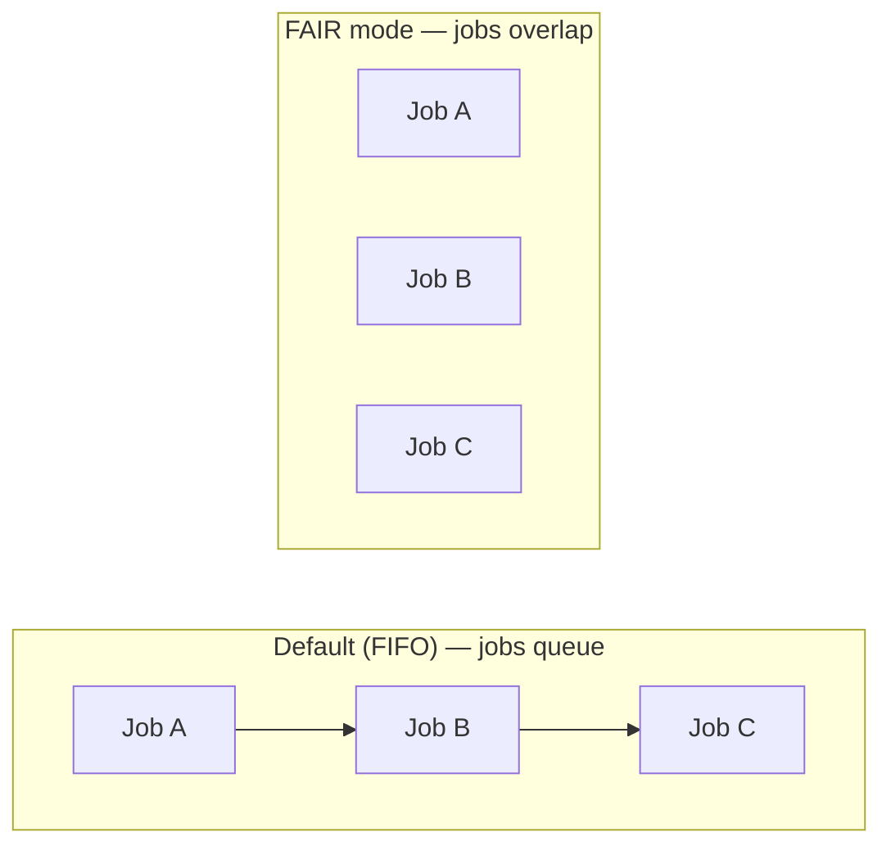
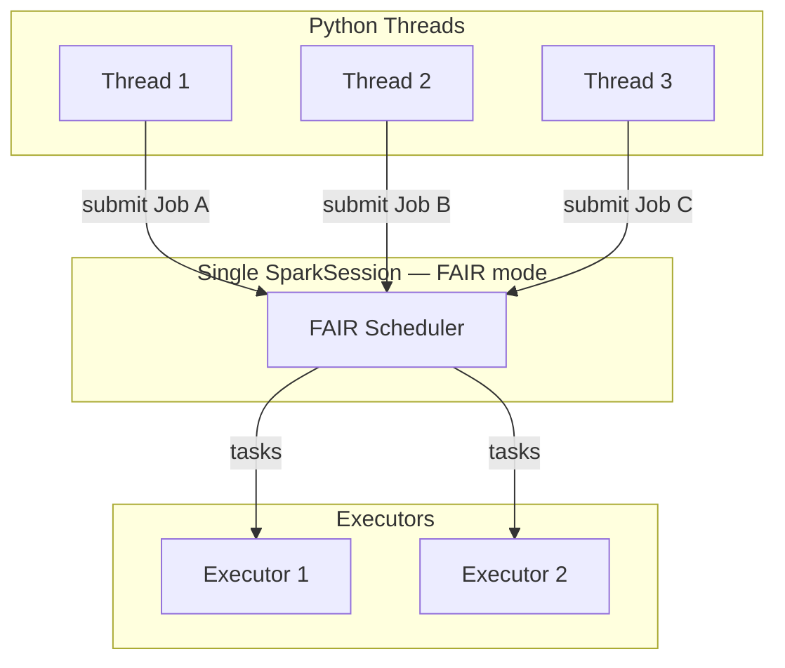

# PySpark Parallel Queries

Apache Spark already parallelises work **within** a single job — stages are split into
tasks that run concurrently across executor cores. What this project demonstrates is
how to run **multiple independent Spark jobs simultaneously** from one application,
maximising resource utilisation when the jobs have no data dependency on each other.



For the same work, a parallel Spark application typically finishes in **one quarter
to one half** of the time taken by the sequential default.

---

## All Patterns at a Glance

| Pattern | Module | Best for |
| ------- | ------ | -------- |
| [threading.Thread](patterns/threading.md) | `thread_jobs/word_char_count.py` | Two or three independent actions |
| [ThreadPool](patterns/threadpool.md) | `threadpool/df_actions.py`, `threadpool/jdbc_ingestion.py` | Fan-out over a list of inputs |
| [Futures](patterns/futures.md) | `futures/async_futures.py`, `futures/concurrent_jobs.py` | Heterogeneous jobs, consume results as they arrive |
| [Queue Worker Pool](patterns/queue.md) | `queue_pool/queue_worker.py` | Large work queue with bounded concurrency |
| [InheritableThread](patterns/inheritable-thread.md) | `cancellation/inheritable_thread.py` | Job cancellation, thread-local Spark properties |
| [Horizontal Parallelism](patterns/horizontal-parallelism.md) | `threadpool/horizontal_parallelism.py` | Column-independent operations (stats, dedup) |
| [FAIR Scheduler](scheduling/fair-scheduler.md) | `scheduling/fair_scheduler.py`, `scheduling/threading_fair.py` | Intra-application resource fairness |

---

## Prerequisites

=== "pip"
    ```bash
    pip install pyspark==3.5.0
    ```

=== "conda"
    ```bash
    conda install -c conda-forge pyspark=3.5.0
    ```

=== "uv"
    ```bash
    uv add pyspark
    ```

!!! warning "Java 11 required"
    Check with `java -version`. Install with `brew install openjdk@11` (macOS)
    or `sudo apt-get install openjdk-11-jdk` (Ubuntu/Debian).

---

## Quick Start

```bash
# Clone and enter the project
cd spark-python/pyspark-parallel-queries

# Run any pattern directly
SPARK_MASTER=local[*] python src/parallel/thread_jobs/word_char_count.py
SPARK_MASTER=local[*] python src/parallel/futures/concurrent_jobs.py
SPARK_MASTER=local[*] python src/parallel/threadpool/df_actions.py

# Run all tests
pytest src/parallel/tests/ -v

# Preview these docs
mkdocs serve
```

!!! tip "No cluster needed"
    Every script defaults to `local[*]` — all parallelism runs on your laptop
    using multiple threads in a single JVM process.

---

## How the FAIR Scheduler Works

By default, Spark runs jobs in **FIFO** order: Job B waits until Job A finishes,
even if the cluster has spare capacity. Enabling **FAIR** mode makes the scheduler
interleave tasks from all in-flight jobs in round-robin order.



Enable it with one config:

```python
spark = (SparkSession.builder
         .config("spark.scheduler.mode", "FAIR")
         .getOrCreate())
```

Per-thread pool assignment:

```python
spark.sparkContext.setLocalProperty("spark.scheduler.pool", "production")
```
