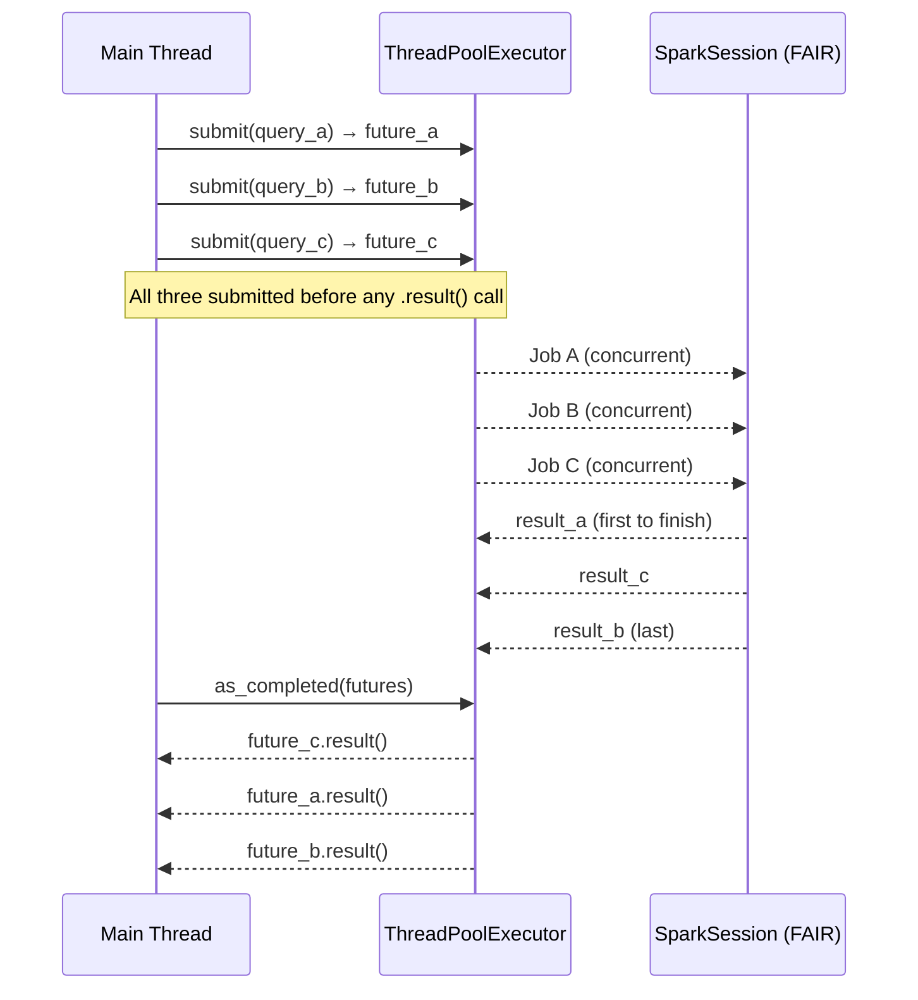

# Futures

`concurrent.futures.ThreadPoolExecutor` submits jobs and returns a `Future`
handle immediately, before the job finishes. This lets you submit **all** jobs
upfront, then consume results as they complete via `as_completed()` — the most
flexible parallel pattern when jobs are heterogeneous or you want non-blocking
result handling.

!!! note "Python futures vs Scala countAsync"
    PySpark's Scala API exposes `countAsync()`/`foreachAsync()`, but these are
    not available in the Python API. `ThreadPoolExecutor.submit()` is the
    Python-idiomatic equivalent and achieves the same concurrent execution.

## How It Works



The critical rule: **submit all futures before calling `.result()` on any of
them**. Calling `.result()` before the others are submitted would block the
main thread and prevent true parallelism.

## When to Use

!!! success "Good fit"
    - Heterogeneous queries that return different types or row counts
    - Processing results as they finish (not waiting for the slowest)
    - Exception handling per job — `.result()` re-raises any exception thrown in the worker

!!! failure "Not suitable"
    - Homogeneous fan-out where all results are needed in order (use [ThreadPool](threadpool.md))
    - Very large numbers of jobs where bounded concurrency matters (use [Queue](queue.md))

## Pattern 1 — Submit Before Get

```python title="src/parallel/futures/async_futures.py"
--8<-- "src/parallel/futures/async_futures.py"
```

## Pattern 2 — Heterogeneous Queries with `as_completed`

```python title="src/parallel/futures/concurrent_jobs.py"
--8<-- "src/parallel/futures/concurrent_jobs.py"
```

## Run

```bash
SPARK_MASTER=local[*] python src/parallel/futures/async_futures.py
SPARK_MASTER=local[*] python src/parallel/futures/concurrent_jobs.py
```

Expected output:

```
range(0, 1_000_000)         count = 1,000,000
range(1_000_000, 2_000_000) count = 1,000,000
sum(1..100)                       = 5,050
All futures resolved in 1.23s

Serial   : 2.89s
Parallel : 1.05s
Speedup  : 2.75x
```

## Exception Handling

Unlike `ThreadPool.map()` (which swallows exceptions), `Future.result()`
re-raises any exception that occurred in the worker thread:

```python
from concurrent.futures import ThreadPoolExecutor

with ThreadPoolExecutor(max_workers=3) as executor:
    futures = {executor.submit(fn, arg): arg for arg in args}

for future in as_completed(futures):
    arg = futures[future]
    try:
        result = future.result()
    except Exception as exc:
        print(f"Job for {arg!r} failed: {exc}")
```

## Configuration Reference

| Config key | Value | Description |
| ---------- | ----- | ----------- |
| `spark.scheduler.mode` | `FAIR` | Required for concurrent job execution |
| `max_workers` | `len(queries)` | One thread per job; tune down if memory is constrained |
| `DATA_HOME` env var | path | Directory containing input CSV (falls back to in-memory sample) |
