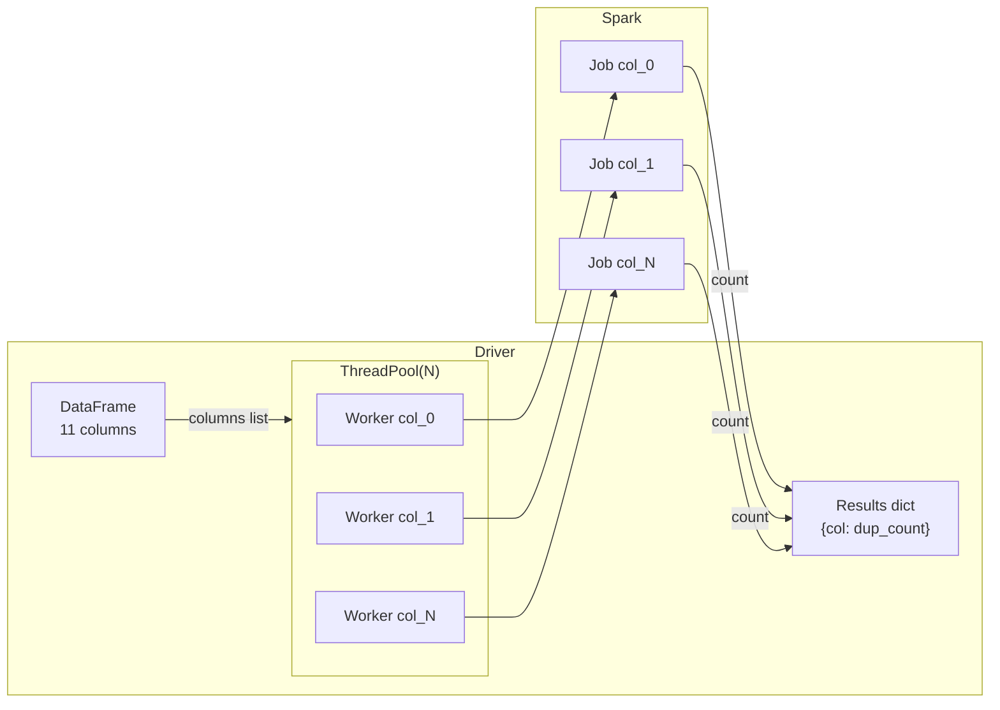

# Horizontal Parallelism

Horizontal parallelism applies the **same operation to every column** of a
DataFrame simultaneously. It is distinct from the other patterns because there
is no single "big" parallel job — instead, there are N small jobs (one per column)
that run concurrently.

Common use cases: null counts, cardinality, duplicate counts, per-column statistics.

## How It Works



The pool size determines how many columns are processed at once. Benchmarking
shows diminishing returns beyond `cpu_count()` because executor cores become
the bottleneck.

## Benchmark Results

Running duplicate-count on a Titanic-sized dataset (891 rows, 11 columns):

| Strategy | Pool size | Time |
| -------- | --------- | ---- |
| Sequential for-loop | 1 | baseline |
| `ThreadPool(2)` | 2 | ~0.55× baseline |
| `ThreadPool(cpu_count)` | 8 | ~0.25× baseline |
| `ThreadPool(ncols=11)` | 11 | ~0.22× baseline |

!!! tip "Optimal pool size"
    `ThreadPool(len(df.columns))` is usually optimal — one thread per column
    minimises wall-clock time when the number of columns is small (< 50).
    For wide schemas, cap at `cpu_count()` to avoid JVM thread overhead.

## When to Use

!!! success "Good fit"
    - Null/missing value counts across all columns
    - Cardinality (distinct count) per column
    - Duplicate detection per column
    - Per-column type casting or validation

!!! failure "Not suitable"
    - Operations that depend on multiple columns simultaneously (use a single Spark job)
    - Very wide schemas (> 200 columns) — the JVM scheduler overhead dominates

## Code

```python title="src/parallel/threadpool/horizontal_parallelism.py"
--8<-- "src/parallel/threadpool/horizontal_parallelism.py"
```

## Run

```bash
SPARK_MASTER=local[*] python "src/parallel/threadpool/horizontal_parallelism.py"

# With a real Titanic CSV:
TITANIC_CSV=/path/to/titanic.csv \
python "src/parallel/threadpool/horizontal_parallelism.py"
```

## Thread-Safe Result Collection

```python
from threading import Lock
from multiprocessing.pool import ThreadPool

results: dict = {}
lock = Lock()

def count_dups(col: str) -> None:
    dup_count = total - df.dropDuplicates([col]).count()
    with lock:              # (1)!
        results[col] = dup_count

with ThreadPool(len(df.columns)) as pool:
    pool.map(count_dups, df.columns)
```

1. `dict.__setitem__` is not atomic in CPython under all conditions — the lock guarantees correctness.

## Configuration Reference

| Config key / env var | Value | Description |
| -------------------- | ----- | ----------- |
| `spark.scheduler.mode` | `FAIR` | Required for concurrent column jobs |
| `TITANIC_CSV` env var | path | CSV input file (blank = in-memory sample) |
| `SPARK_MASTER` env var | `local[*]` | Use all CPU cores |
