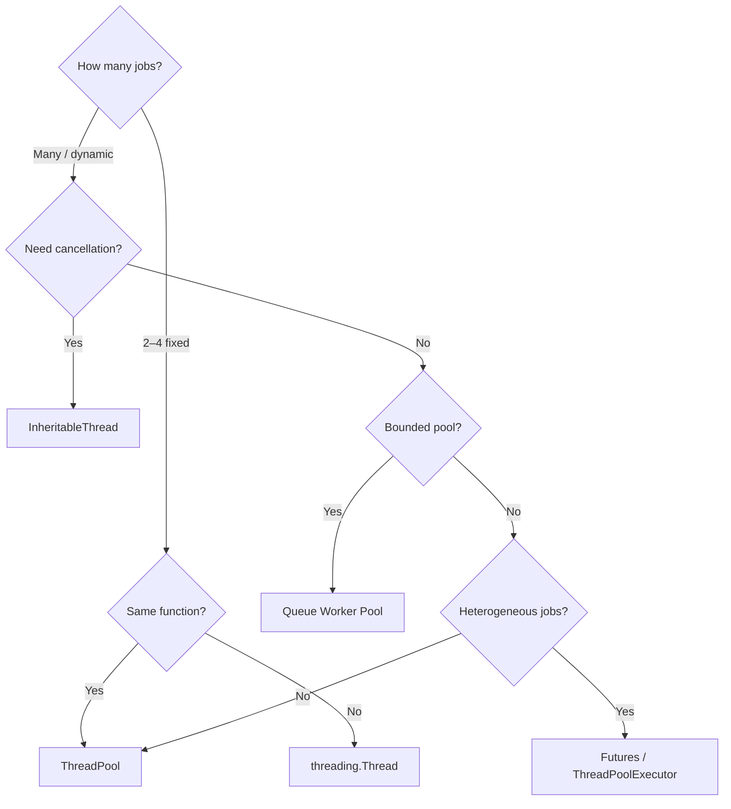

# Parallel Execution Patterns

Six patterns cover every parallel execution scenario in PySpark. Choose based
on the shape of your workload:

| Pattern | API | Jobs | Use when |
| ------- | --- | ---- | -------- |
| [threading.Thread](threading.md) | `threading.Thread` | 2–4 | Simple, named parallel actions |
| [ThreadPool](threadpool.md) | `ThreadPool.map()` | N (homogeneous) | Same function applied to a list |
| [Futures](futures.md) | `ThreadPoolExecutor.submit()` | N (heterogeneous) | Different functions; consume results as they arrive |
| [Queue Worker Pool](queue.md) | `queue.Queue` + `Thread` | Large N (bounded) | Long work queue, bounded concurrency |
| [InheritableThread](inheritable-thread.md) | `InheritableThread` | 2+ | Job cancellation; thread-local Spark properties |
| [Horizontal Parallelism](horizontal-parallelism.md) | `ThreadPool.map()` | One per column | Column-independent per-column ops |

---

## Decision Guide

---

!!! note "All patterns require FAIR mode"
    Without `spark.scheduler.mode = FAIR`, later jobs wait behind the first
    even when executor cores are available.  See [FAIR Scheduler](../scheduling/fair-scheduler.md).
