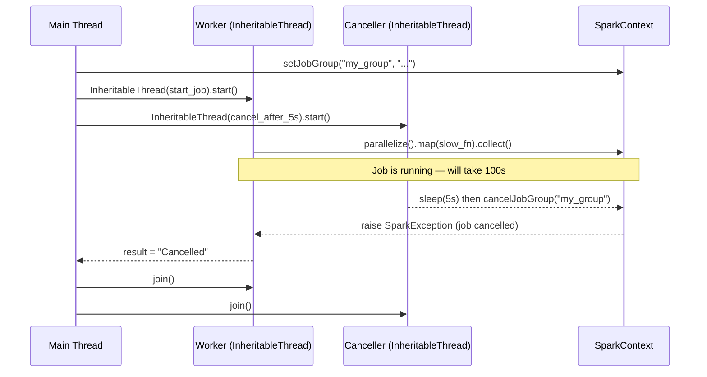

# InheritableThread

PySpark's `InheritableThread` is a drop-in replacement for `threading.Thread`
that **propagates Spark thread-local properties** (such as the job group ID and
scheduler pool) from the parent thread to the child thread. It is required
whenever a child thread needs to call `SparkContext.cancelJobGroup()` or
`SparkContext.setLocalProperty()` with inherited context.

## Why Not `threading.Thread`?

Spark stores properties like `spark.scheduler.pool` and job group IDs in
**thread-local storage**. A standard `threading.Thread` starts with an empty
thread-local namespace — it does not inherit anything from the parent. This
means `cancelJobGroup()` called from a plain thread has no effect on a job
started in a different thread.

`InheritableThread` copies the parent's thread-local Spark properties into the
child at creation time, making cancellation work correctly.

## How It Works



## When to Use

!!! success "Good fit"
    - Timeout-based job cancellation (cancel after N seconds)
    - User-triggered cancellation (cancel on HTTP request)
    - Any scenario where a child thread must inherit `scheduler.pool` or a job group

!!! failure "Use plain `threading.Thread` when"
    - No cancellation is needed
    - All threads are at the same level (no parent-child property inheritance)

## Code

```python title="src/parallel/cancellation/inheritable_thread.py"
--8<-- "src/parallel/cancellation/inheritable_thread.py"
```

## Run

```bash
SPARK_MASTER=local[*] python src/parallel/cancellation/inheritable_thread.py
```

Expected output:

```
Job result: Cancelled
```

## Cancellation Pattern

```python
from pyspark import InheritableThread

def long_running_job() -> None:
    sc.setJobGroup("job_to_cancel", "description")
    result = sc.parallelize(range(1000)).map(slow_fn).collect()

def cancel_after(seconds: float) -> None:
    time.sleep(seconds)
    sc.cancelJobGroup("job_to_cancel")  # (1)!

worker    = InheritableThread(target=long_running_job)
canceller = InheritableThread(target=cancel_after, args=(5.0,))
worker.start()
canceller.start()
worker.join()
canceller.join()
```

1. Works because `InheritableThread` propagated the job group context from the parent.

## Configuration Reference

| Config key | Value | Description |
| ---------- | ----- | ----------- |
| `spark.scheduler.mode` | `FAIR` | Recommended when cancellable jobs run alongside others |
| Job group ID | any string | Unique identifier — use `cancelJobGroup(id)` to stop all jobs in this group |
