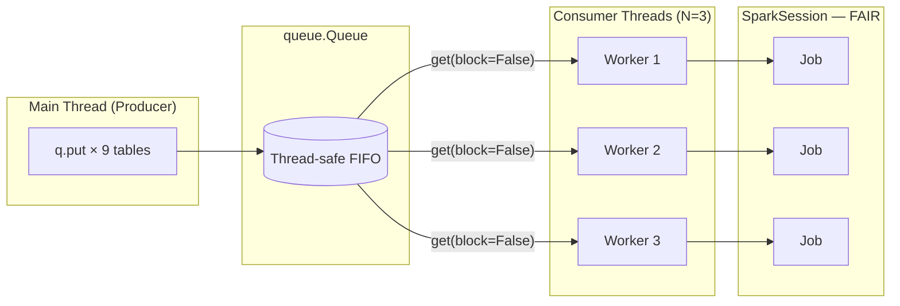

# Queue Worker Pool

A `queue.Queue` fed by a producer and drained by a fixed pool of consumer threads.
This is the right pattern when you have a **large, dynamic work queue** and want
**bounded concurrency** — processing at most N tables at a time regardless of how
many items are in the queue.

## How It Works



Workers drain the queue until it is empty, then exit. The main thread calls
`t.join()` on each worker to wait for full completion.

## TOCTOU Race — The Correct Drain Pattern

```python
# ❌ WRONG — race condition when multiple workers drain simultaneously
while not q.empty():      # thread A checks: not empty
    item = q.get()        # thread B also passed the check and got the last item
                          # thread A now blocks forever or raises queue.Empty

# ✅ CORRECT
while True:
    try:
        item = q.get(block=False)   # (1)!
    except queue.Empty:
        break                       # (2)!
    try:
        process(item)
    finally:
        q.task_done()               # (3)!
```

1. Atomic get — either succeeds or raises `queue.Empty` immediately.
2. Queue is exhausted — this worker is done.
3. Signal completion so `q.join()` can unblock (if used).

## When to Use

!!! success "Good fit"
    - Loading 10–100 JDBC tables with 3–5 parallel workers
    - Back-pressure: you want to limit how many Spark jobs run at once
    - Dynamic queue where items are added while workers are running

!!! failure "Not suitable"
    - Fixed small number of jobs (use [threading.Thread](threading.md) instead)
    - When you need results from all jobs before proceeding (use [Futures](futures.md))

## Code

```python title="src/parallel/queue_pool/queue_worker.py"
--8<-- "src/parallel/queue_pool/queue_worker.py"
```

## Run

```bash
SPARK_MASTER=local[*] python src/parallel/queue_pool/queue_worker.py

# With a real MySQL source (start with docker compose first):
docker compose up -d
JDBC_URL=jdbc:mysql://localhost:3306/tutorials \
JDBC_USER=root \
JDBC_PASS=MySQL_2023 \
WORKER_COUNT=3 \
python src/parallel/queue_pool/queue_worker.py
```

## Tuning `WORKER_COUNT`

| Queue size | Recommendation |
| ---------- | -------------- |
| ≤ 5 items | `WORKER_COUNT = len(items)` — one worker per item |
| 6–20 items | `WORKER_COUNT = cpu_count()` — match available cores |
| > 20 items | `WORKER_COUNT = 4–8` — limit JVM thread overhead |

## Configuration Reference

| Config key / env var | Default | Description |
| -------------------- | ------- | ----------- |
| `spark.scheduler.mode` | `FAIR` | Required for concurrent jobs |
| `spark.scheduler.pool` | `production` | Pool assignment (set inside each worker) |
| `WORKER_COUNT` env var | `3` | Number of parallel consumer threads |
| `JDBC_URL` env var | `""` | Blank = use in-memory sample data |
| `OUTPUT_PATH` env var | `/tmp/queue_output` | Parquet output base directory |
