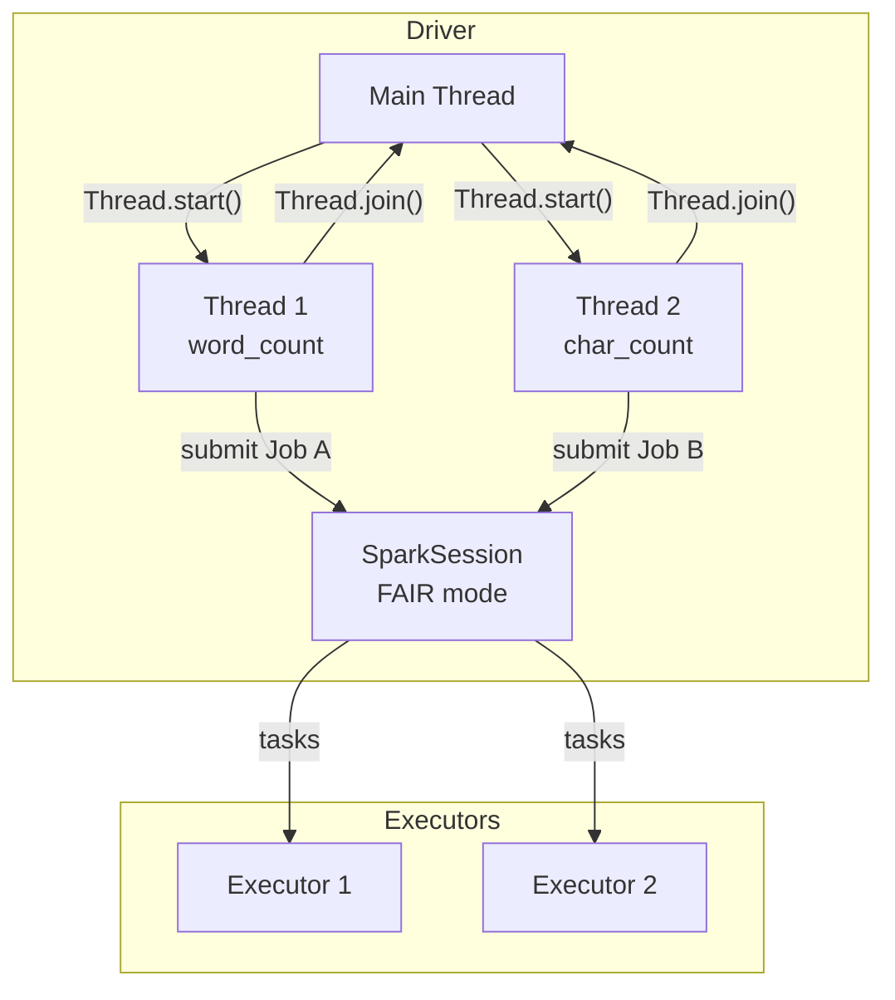

# threading.Thread

The simplest parallel pattern: wrap each Spark action in a `threading.Thread`,
start both threads, then `join()` to wait for completion. The FAIR scheduler
interleaves tasks from all in-flight jobs across executor cores.

## How It Works



Both threads share the same `SparkSession` — no synchronisation is needed for
the Spark calls themselves. A `threading.Lock` is only required if the threads
write to a shared Python data structure.

## When to Use

!!! success "Good fit"
    - Two or three fixed, named parallel actions
    - One cached DataFrame feeding multiple independent aggregations
    - Word count + char count; regional rollups submitted simultaneously

!!! failure "Not suitable"
    - More than ~8 jobs (use [ThreadPool](threadpool.md) or [Futures](futures.md) instead)
    - Jobs whose inputs depend on each other's outputs

## Code

```python title="src/parallel/thread_jobs/word_char_count.py"
--8<-- "src/parallel/thread_jobs/word_char_count.py"
```

## Run

```bash
SPARK_MASTER=local[*] python src/parallel/thread_jobs/word_char_count.py
```

Expected output (times will vary):

```
Serial   : 3.42s
Parallel : 1.87s
Speedup  : 1.83x
```

## Key Rules

- Always call `t.join()` on every thread before reading results or exiting.
- Assign each thread to a FAIR pool with `spark.sparkContext.setLocalProperty("spark.scheduler.pool", "production")` inside the target function.
- For shared Python state (dicts, lists), protect writes with a `threading.Lock`.

## Configuration Reference

| Config key | Value | Description |
| ---------- | ----- | ----------- |
| `spark.scheduler.mode` | `FAIR` | Required — otherwise threads queue behind each other |
| `spark.scheduler.pool` | `production` | Per-thread pool name (set inside each thread) |
| `SPARK_MASTER` env var | `local[*]` | Use all CPU cores for local testing |
