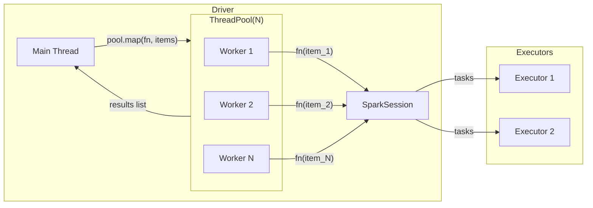

# ThreadPool

`multiprocessing.pool.ThreadPool` applies the same function to a list of inputs
in parallel. It is the right choice when you have N homogeneous jobs — loading N
tables, querying N regions, or analysing N columns — and want to fan out with a
fixed number of worker threads.

!!! note "ThreadPool vs multiprocessing.Pool"
    `ThreadPool` is thread-based (same process, same JVM). `multiprocessing.Pool`
    is process-based and would require a new JVM per process — far more expensive.
    Always use `ThreadPool` for Spark parallelism.

## How It Works



`pool.map()` blocks until all workers finish and returns a list of results in
input order — no explicit `join()` required.

## When to Use

!!! success "Good fit"
    - JDBC ingestion: load multiple tables in parallel
    - Per-region or per-date aggregations
    - Fan-out writes: partition each table to a separate output path

!!! failure "Not suitable"
    - Jobs that need to return different types or be consumed as they complete (use [Futures](futures.md))
    - Unbounded queues where you want back-pressure (use [Queue Worker Pool](queue.md))

## Pattern 1 — DataFrame Actions

Parallel aggregations over regions using `ThreadPool.starmap`:

```python title="src/parallel/threadpool/df_actions.py"
--8<-- "src/parallel/threadpool/df_actions.py"
```

## Pattern 2 — Parallel JDBC Ingestion

Load multiple database tables concurrently:

```python title="src/parallel/threadpool/jdbc_ingestion.py"
--8<-- "src/parallel/threadpool/jdbc_ingestion.py"
```

## Run

```bash
SPARK_MASTER=local[*] python src/parallel/threadpool/df_actions.py
SPARK_MASTER=local[*] python src/parallel/threadpool/jdbc_ingestion.py

# With a real JDBC source:
JDBC_URL=jdbc:mysql://localhost:3306/tutorials \
JDBC_USER=root \
JDBC_PASS=secret \
python src/parallel/threadpool/jdbc_ingestion.py
```

## Thread Safety

`pool.map()` returns results in order — safe to build a dict directly from the
return values. If you instead collect results via a side-effect (appending to a
shared list), protect it with a `Lock`:

```python
from threading import Lock

results: list = []
lock = Lock()

def collect(item: str) -> None:
    count = df.filter(F.col("x") == item).count()
    with lock:
        results.append((item, count))  # (1)!

with ThreadPool(len(items)) as pool:
    pool.map(collect, items)
```

1. Append is not atomic — the lock prevents data races between workers.

## Configuration Reference

| Config key | Value | Description |
| ---------- | ----- | ----------- |
| `spark.scheduler.mode` | `FAIR` | Required for concurrent job execution |
| `JDBC_URL` env var | `jdbc:...` | JDBC connection string (never hard-code) |
| `JDBC_USER` / `JDBC_PASS` | `...` | Credentials from environment variables |
| `OUTPUT_PATH` env var | `/tmp/...` | Output base directory |
