# FAIR Scheduler

Spark's FAIR scheduler distributes executor slots across all in-flight jobs in
round-robin order. Short jobs submitted while a long job is running receive
resources immediately instead of waiting in a queue.

## FIFO vs FAIR

```mermaid
gantt
    title FIFO — Job B and C starve until Job A finishes
    dateFormat  X
    axisFormat  %s s

    section Job A (large)
    Running : 0, 6

    section Job B (medium)
    Waiting : crit, 0, 6
    Running : 6, 9

    section Job C (small)
    Waiting : crit, 0, 9
    Running : 9, 10
```

```mermaid
gantt
    title FAIR — All jobs share resources, C finishes first
    dateFormat  X
    axisFormat  %s s

    section Job A (large)
    Running : 0, 7

    section Job B (medium)
    Running : 0, 5

    section Job C (small)
    Running : 0, 2
```





## Enabling FAIR Mode

Set the scheduler mode at session level:

```python
spark = (SparkSession.builder
         .config("spark.scheduler.mode", "FAIR")
         .getOrCreate())
```

To use named pools with custom weights, also point to the pool config file:

```python
.config("spark.scheduler.allocation.file", "src/parallel/scheduling/fairscheduler.xml")
```

## Pool Assignment

Set inside **each thread** using `setLocalProperty` — this writes to
thread-local storage so different threads can use different pools:

```python
def worker_fn() -> None:
    spark.sparkContext.setLocalProperty("spark.scheduler.pool", "production")
    spark.sparkContext.setJobDescription("ETL job — orders table")
    result = df.count()   # submitted to the production pool
```

!!! warning "setLocalProperty is thread-local"
    Calling `setLocalProperty` on the main thread does **not** affect child
    threads. Each thread must set its own pool after it starts.

## Code

```python title="src/parallel/scheduling/fair_scheduler.py"
--8<-- "src/parallel/scheduling/fair_scheduler.py"
```

## Run

```bash
SPARK_MASTER=local[*] python src/parallel/scheduling/fair_scheduler.py
```

Expected output:

```
Job   Pool           Range        Count
0     production 5,000,000    5,000,000
1     production 3,000,000    3,000,000
2     test       1,000,000    1,000,000
3     test         500,000      500,000

All 4 concurrent jobs finished in 2.14s
```

## Combining with All Other Patterns

FAIR mode is not exclusive to this example — enable it in every script that
submits parallel jobs:

```python
# threading.Thread
spark.config("spark.scheduler.mode", "FAIR")
t1 = threading.Thread(target=lambda: spark.sparkContext.setLocalProperty("spark.scheduler.pool","production") or df1.count())

# ThreadPool
spark.config("spark.scheduler.mode", "FAIR")
with ThreadPool(4) as pool:
    pool.map(lambda t: (spark.sparkContext.setLocalProperty("spark.scheduler.pool","production"), df.filter(...).count()), tables)

# ThreadPoolExecutor
spark.config("spark.scheduler.mode", "FAIR")
with ThreadPoolExecutor(max_workers=3) as ex:
    futures = [ex.submit(lambda: df.count()) for df in dfs]
```

## Configuration Reference

| Config key | Value | Description |
| ---------- | ----- | ----------- |
| `spark.scheduler.mode` | `FAIR` | Enable fair scheduling |
| `spark.scheduler.allocation.file` | path to XML | Pool definitions (optional; uses defaults if absent) |
| `spark.scheduler.pool` (thread-local) | pool name | Assign the current thread's jobs to a named pool |
| `spark.scheduler.minRegisteredResourcesRatio` | `0.0` | Minimum executor ratio before scheduling starts |
