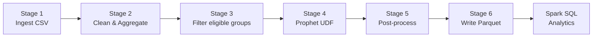

# End-to-End Pipeline

A complete six-stage pipeline: raw CSV → clean daily series → Prophet forecasts
→ anomaly detection → Parquet output → Spark SQL analytics.

---

## Pipeline stages



---

## Stage 1 — Ingest

Read raw CSV with string types for all columns (cast later):

```python
raw_schema = StructType([
    StructField("region",   StringType(), True),
    StructField("date",     StringType(), True),
    StructField("revenue",  StringType(), True),
    StructField("quantity", StringType(), True),
])

raw_sdf = spark.read.csv(path, schema=raw_schema, header=True)
```

---

## Stage 2 — Clean & aggregate

```python
clean_sdf = (
    raw_sdf
    .withColumn("ds",  F.to_date("date", "yyyy-MM-dd"))
    .withColumn("y",   F.col("revenue").cast(DoubleType()))
    .filter(F.col("ds").isNotNull() & F.col("y").isNotNull() & (F.col("y") >= 0))
    .dropDuplicates(["region", "ds"])
)

daily_sdf = (
    clean_sdf
    .groupby("region", "ds")
    .agg(F.sum("y").alias("y"))
)
```

---

## Stage 3 — Filter eligible groups

Only run Prophet on groups with enough history:

```python
MIN_DAYS = 365

eligible = (
    daily_sdf
    .groupby("region").agg(F.count("ds").alias("n"))
    .filter(F.col("n") >= MIN_DAYS)
    .select("region")
)

model_input = daily_sdf.join(eligible, on="region", how="inner")
```

---

## Stage 4 — Prophet UDF

```python
def prophet_forecast(group_df: pd.DataFrame) -> pd.DataFrame:
    from prophet import Prophet

    region = group_df["region"].iloc[0]
    train  = group_df[group_df["ds"] <= CUTOFF][["ds", "y"]]
    train["ds"] = pd.to_datetime(train["ds"])

    model = Prophet(yearly_seasonality=True, weekly_seasonality=True,
                    seasonality_mode="multiplicative", interval_width=0.95)
    model.add_country_holidays(country_name="US")
    model.fit(train)

    future   = model.make_future_dataframe(periods=90, include_history=True)
    forecast = model.predict(future)
    forecast["region"] = region
    forecast["split"]  = forecast["ds"].apply(
        lambda d: "train" if d <= pd.Timestamp(CUTOFF) else "forecast"
    )
    return forecast[["region", "ds", "yhat", "yhat_lower", "yhat_upper", "split"]] \
               .assign(ds=lambda df: df["ds"].dt.date)

forecast_sdf = (
    model_input
    .repartition(n_groups, "region")
    .groupby("region")
    .applyInPandas(prophet_forecast, schema=result_schema)
    .cache()
)
```

---

## Stage 5 — Post-processing

```python
# Join actuals for residual analysis
results = (
    forecast_sdf
    .join(daily_sdf.withColumnRenamed("y", "actual"), on=["region", "ds"], how="left")
    .withColumn("residual",  F.col("yhat") - F.col("actual"))
    .withColumn("pct_error",
        F.when(F.col("actual") > 0,
               F.abs("residual") / F.col("actual") * 100).otherwise(None))
)

# Anomaly flag
anomalies = (
    results
    .filter(F.col("split") == "train")
    .filter(
        (F.col("actual") < F.col("yhat_lower")) |
        (F.col("actual") > F.col("yhat_upper"))
    )
)
```

---

## Stage 6 — Write results

```python
results.write.mode("overwrite").partitionBy("region").parquet("/output/forecasts")
```

---

## Source file

```
src/03_e2e_pipeline.py
```
