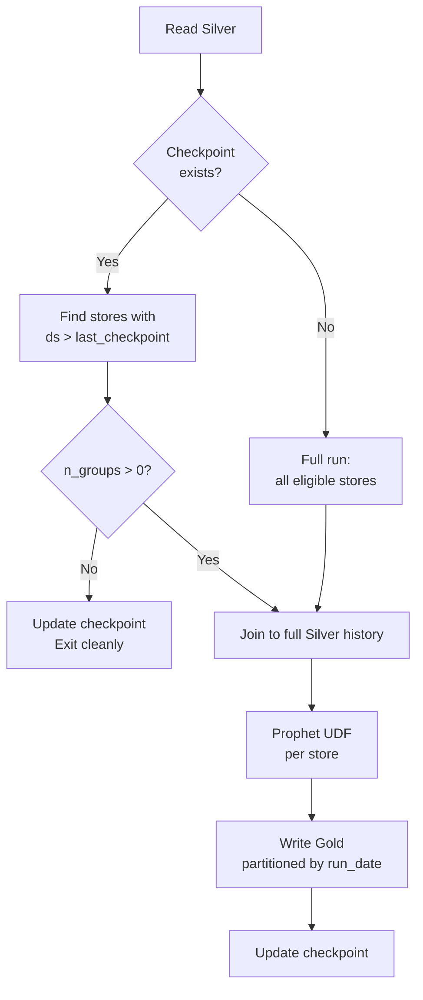

# Incremental Processing

Run the pipeline daily, touching only groups that have new data since the last run.

---

## The problem with naive re-runs

Re-running Prophet on all groups every day is expensive when most groups
haven't received new data. The incremental pattern solves this by:

1. Checking which groups have rows newer than the last checkpoint.
2. Running Prophet only on those groups.
3. Using **full history** for each group that does run (Prophet needs all history to fit).

---

## Checkpoint

A tiny JSON file records the last successfully processed date:

```python
import json, os

CHECKPOINT = "/data/medallion/_checkpoints/last_processed"

def read_checkpoint(path):
    ck = f"{path}/checkpoint.json"
    if os.path.exists(ck):
        return json.load(open(ck))["last_processed"]
    return None

def write_checkpoint(path, last_date):
    os.makedirs(path, exist_ok=True)
    with open(f"{path}/checkpoint.json", "w") as f:
        json.dump({"last_processed": last_date}, f)
```

---

## Incremental logic — the correct pattern

!!! danger "Common mistake: filtering before eligibility check"
    If you filter Silver to only new rows **before** computing eligibility,
    groups without new data appear to have 0 rows → `n_groups = 0` →
    `repartition(0, ...)` throws `IllegalArgumentException`.

### Correct implementation

```python
silver_full = spark.read.parquet(SILVER_PATH)

# (1) Eligibility always uses FULL history
eligible = (
    silver_full
    .groupby("store").agg(F.count("ds").alias("n"))
    .filter(F.col("n") >= MIN_HISTORY_DAYS)
    .select("store")
)

last_processed = read_checkpoint(CHECKPOINT)

if last_processed:
    # (2) Identify stores with new rows since last run
    stores_with_new = (
        silver_full
        .filter(F.col("ds") > F.lit(last_processed).cast(DateType()))
        .select("store").distinct()
    )
    # (3) Intersect: eligible AND has new data
    stores_to_run = eligible.join(stores_with_new, on="store", how="inner")
else:
    # First run — process everything
    stores_to_run = eligible

n_groups = stores_to_run.count()

# (4) Guard against empty set
if n_groups == 0:
    print("No new data — nothing to do.")
    write_checkpoint(CHECKPOINT, run_date)
    spark.stop()
    raise SystemExit(0)

# (5) model_input uses FULL silver history for the selected stores
model_input = silver_full.join(stores_to_run, on="store", how="inner")
```

---

## Decision flow



---

## Idempotency

Every Gold write is partitioned by `run_date`.
Re-running the same `run_date` overwrites only that partition,
leaving all other dates intact:

```python
gold_sdf.write \
    .mode("overwrite") \
    .partitionBy("run_date", "store") \
    .parquet(GOLD_PATH)
```

---

## Source file

```
src/07_medallion_prophet_pipeline.py   ← Gold layer section
```
