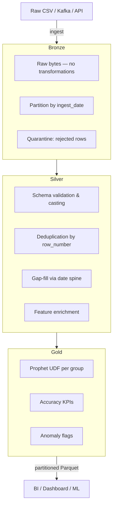

# Medallion Architecture

A production-grade layered data model: **Bronze → Silver → Gold**.
Each layer has a single, clearly bounded responsibility.

---

## Layer overview



---

## Bronze — raw ingest

**Rule:** store exactly what arrived. No casts. No filters.

```python
raw_sdf.write.mode("overwrite").partitionBy("ingest_date").parquet(BRONZE_PATH)
```

---

## Silver — clean & enrich

### Schema validation

Cast string columns; then apply row-level rules:

```python
typed = (
    bronze_sdf
    .withColumn("ds",  F.to_date("sale_date", "yyyy-MM-dd"))
    .withColumn("y",   F.col("revenue").cast(DoubleType()))
)

valid    = typed.filter(F.col("ds").isNotNull() & F.col("y").isNotNull() & (F.col("y") >= 0))
rejected = typed.subtract(valid) \
                .withColumn("rejection_reason",
                    F.when(F.col("ds").isNull(), "invalid_date")
                     .when(F.col("y").isNull() | (F.col("y") < 0), "invalid_revenue")
                     .otherwise("unknown"))

rejected.write.mode("overwrite").partitionBy("quarantine_date").parquet(REJECT_PATH)
```

### Deduplication

Use `row_number()` to keep the most recently ingested version per natural key:

```python
w = Window.partitionBy("store", "ds").orderBy(F.desc("ingested_at"))
deduped = (
    valid
    .withColumn("_rn", F.row_number().over(w))
    .filter(F.col("_rn") == 1)
    .drop("_rn")
)
```

!!! warning "Do not use `dropDuplicates()` here"
    `dropDuplicates()` keeps an arbitrary row. `row_number()` over `ingested_at`
    deterministically keeps the **latest** version.

### Gap filling

Join to a complete date spine before forward-filling:

```python
w_ff    = Window.partitionBy("store").orderBy("ds").rowsBetween(Window.unboundedPreceding, 0)
silver  = date_spine.join(deduped, on=["store", "ds"], how="left") \
                    .withColumn("y", F.last("y", ignorenulls=True).over(w_ff)) \
                    .withColumn("is_imputed", F.col("original_y").isNull())
```

---

## Gold — forecasts, KPIs, anomalies

### Eligibility

Always compute eligibility from **full** Silver history:

```python
eligible = (
    silver_full
    .groupby("store").agg(F.count("ds").alias("n"))
    .filter(F.col("n") >= MIN_HISTORY_DAYS)
    .select("store")
)
```

### Prophet UDF (Gold layer)

```python
gold_sdf = (
    silver_full.join(stores_to_run, on="store")
    .repartition(n_groups, "store")
    .groupby("store")
    .applyInPandas(gold_forecast, schema=gold_schema)
    .cache()
)

gold_sdf.write.mode("overwrite").partitionBy("run_date", "store").parquet(GOLD_PATH)
```

---

## Pipeline configuration

Keep all tunable constants in a single dict at the top of the file:

```python
PIPELINE_CONFIG = {
    "base_path":               "/data/medallion",
    "forecast_horizon":        90,
    "min_history_days":        180,
    "interval_width":          0.95,
    "changepoint_prior_scale": 0.05,
    "run_date":                str(date.today()),
}
```

---

## Source file

```
src/07_medallion_prophet_pipeline.py
```
