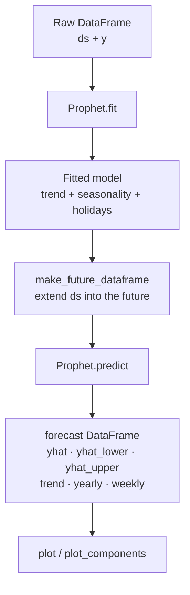

# Prophet Overview

Prophet is a procedure for forecasting time-series data developed by Meta (Facebook). It uses an **additive regression model** composed of four components:

$$
y(t) = g(t) + s(t) + h(t) + \varepsilon_t
$$

| Term | Component | Description |
|------|-----------|-------------|
| $g(t)$ | Trend | Piecewise linear or logistic growth |
| $s(t)$ | Seasonality | Fourier-series periodic patterns (yearly, weekly, daily) |
| $h(t)$ | Holidays | Effect of known irregular events |
| $\varepsilon_t$ | Error | Gaussian noise |

---

## Why Prophet?

- **Handles missing data** — Prophet skips NaN rows in the likelihood automatically.
- **Robust to outliers** — piecewise trend adapts without outlier rows dominating.
- **Interpretable components** — you can inspect trend, seasonality and holiday effects separately.
- **No manual ARIMA tuning** — seasonality is modelled automatically via Fourier series.
- **Scales via PySpark** — one model per group, all groups in parallel via `applyInPandas`.

---

## Data contract

Prophet always expects a DataFrame with **exactly two required columns**:

```python
df = pd.DataFrame({
    "ds": ["2023-01-01", "2023-01-02", ...],   # date string or datetime64
    "y":  [102.3, 98.7, ...]                   # numeric metric to forecast
})
```

| Column | Type | Notes |
|--------|------|-------|
| `ds` | `str` / `datetime64` | `YYYY-MM-DD` or `YYYY-MM-DD HH:MM:SS` |
| `y` | `float` / `int` | The metric to forecast. Set to `NaN` (not delete) to mask outliers. |

Additional columns for logistic growth:

| Column | Required when | Description |
|--------|--------------|-------------|
| `cap` | `growth="logistic"` | Upper saturation point |
| `floor` | `growth="logistic"` + lower bound needed | Lower saturation point |

---

## The sklearn-style API

```python
from prophet import Prophet

m = Prophet()          # 1. instantiate
m.fit(df)              # 2. fit on history
future = m.make_future_dataframe(periods=365)   # 3. extend date range
forecast = m.predict(future)                    # 4. predict
```

### Key output columns from `predict()`

| Column | Description |
|--------|-------------|
| `ds` | Date |
| `yhat` | Point forecast (posterior mean) |
| `yhat_lower` | Lower bound of credible interval |
| `yhat_upper` | Upper bound of credible interval |
| `trend` | Trend component only |
| `yearly` | Yearly seasonality component |
| `weekly` | Weekly seasonality component |
| `holidays` | Holiday effects (when configured) |

---

## Fit-predict lifecycle



---

## Source file

All fundamentals are implemented with full comments in:

```
src/01_prophet_fundamentals.py
```
