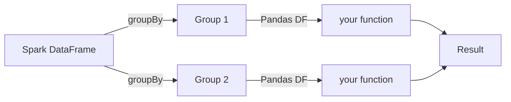

# applyInPandas

`applyInPandas` applies a Python function to each **group** of a grouped
DataFrame. Each group is passed as a complete Pandas DataFrame.

## When to Use

!!! success "Good fit"

    - Per-group statistics (z-scores, percentages, rankings)
    - Group-level ML (fit a model per group)
    - Any operation that needs the full group context

!!! failure "Not a good fit"

    - Row-level transforms without grouping → use [`mapInPandas`](map-in-pandas.md)
    - Single aggregation per group → use [Grouped Aggregate UDFs](../pandas-udf/grouped-aggregate.md)

## How It Works



## Example — Revenue Percentage per Region

```python
import pandas as pd
from pyspark.sql.types import StructType, StructField, StringType, DoubleType

result_schema = StructType([
    StructField("region", StringType()),
    StructField("month", StringType()),
    StructField("revenue", DoubleType()),
    StructField("pct_of_region", DoubleType()),
])

def revenue_pct(pdf: pd.DataFrame) -> pd.DataFrame:           # (1)!
    total = pdf["revenue"].sum()
    pdf["pct_of_region"] = (pdf["revenue"] / total * 100).round(2)
    return pdf

result = (sales_df
          .groupBy("region")
          .applyInPandas(revenue_pct, schema=result_schema))   # (2)!
result.orderBy("region", "month").show()
```

1. Receives one group at a time as a Pandas DataFrame.
2. The output schema can differ from the input — add or remove columns as needed.

## Output

```
+------+-------+-------+-------------+
|region|  month|revenue|pct_of_region|
+------+-------+-------+-------------+
| North|2024-01| 1200.0|        44.44|
| North|2024-02| 1500.0|        55.56|
| South|2024-01|  900.0|        27.27|
| South|2024-02| 1100.0|        33.33|
| South|2024-03| 1300.0|        39.39|
+------+-------+-------+-------------+
```

## Key Points

| Aspect | Detail |
|--------|--------|
| **Input** | `pd.DataFrame` — one complete group |
| **Output** | `pd.DataFrame` — can have a different schema |
| **Shuffle** | Yes — `groupBy` triggers a shuffle |
| **Arrow required** | Yes |
| **Schema** | Must be declared; can differ from input |
