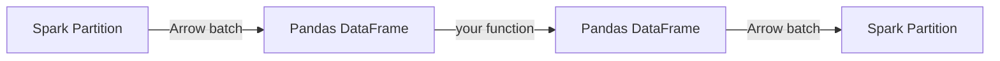

# mapInPandas

`mapInPandas` applies a Python function to each **batch** of rows as a Pandas
DataFrame. It processes the entire DataFrame partition-by-partition without
grouping.

## When to Use

!!! success "Good fit"

    - Row-level or batch-level transforms (normalisation, feature engineering)
    - Operations that benefit from Pandas/NumPy vectorization
    - Replacing slow row-by-row UDFs

!!! failure "Not a good fit"

    - Group-level aggregations → use [`applyInPandas`](apply-in-pandas.md)
    - Single-column transforms → use [Pandas UDFs](../pandas-udf/series-to-series.md)

## How It Works



The function receives an **iterator of Pandas DataFrames** (one per batch) and
must yield Pandas DataFrames with the same schema.

## Example — Normalise Columns

```python
def normalise_batch(iterator):
    for batch in iterator:
        for col_name in batch.columns:
            batch[col_name] = batch[col_name] - batch[col_name].mean()
        yield batch

normalised = df.mapInPandas(normalise_batch, schema=df.schema)  # (1)!
normalised.show(5)
```

1. The `schema` parameter must match the output DataFrame's schema exactly.

## Key Points

| Aspect | Detail |
|--------|--------|
| **Input** | `Iterator[pd.DataFrame]` — one batch per iteration |
| **Output** | `Iterator[pd.DataFrame]` — must yield DataFrames |
| **Schema** | Must be declared upfront via `schema=` |
| **Partitioning** | Operates on existing partitions; does not shuffle |
| **Arrow required** | Yes — Arrow must be enabled |

!!! tip "Batch size"

    Control batch size with `spark.sql.execution.arrow.maxRecordsPerBatch`
    (default: 10,000 rows).
