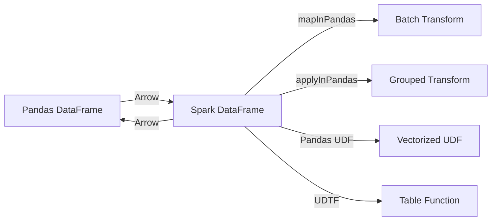

# PySpark + PyArrow

Apache Arrow is an in-memory columnar data format used by Spark to efficiently transfer
data between the JVM and Python processes. This module demonstrates Arrow-optimized
PySpark patterns.

## What You'll Learn



| Topic | Description |
|-------|-------------|
| [Arrow Conversions](arrow/index.md) | `createDataFrame`, `toPandas`, `mapInPandas`, `applyInPandas` |
| [Pandas UDFs](pandas-udf/index.md) | Series→Series, Iterator, Grouped Aggregate, Grouped Map |
| [UDTFs](udtf/index.md) | Basic, Lifecycle, Arrow-optimized table functions |
| [Testing](testing/index.md) | pytest fixtures, test patterns, Java setup |

## Quick Start

=== "pip"

    ```bash
    pip install "pyspark[sql]>=3.5" pyarrow pandas numpy
    ```

=== "poetry"

    ```bash
    poetry install
    ```

=== "uv"

    ```bash
    uv add "pyspark[sql]" pyarrow pandas numpy
    ```

!!! warning "Java 11 required"

    PySpark 3.5.x Arrow support requires **Java 11** (or 17). Java 21 breaks the
    Arrow memory allocator. See [Java Setup](getting-started/java-setup.md).

## Project Layout

```
pyspark-pyarrow/
├── src/psa/
│   ├── spark_env.py           # Java detection & env setup
│   ├── common.py              # Reusable DataFrame transforms
│   ├── pyspark_pyarrow.py     # Arrow conversion examples
│   ├── pandas_udf_spark.py   # Pandas UDF examples
│   └── pyspark_udtf.py       # UDTF examples
├── notebooks/
│   ├── pandas_udf.ipynb
│   └── pyspark_series_to_series.ipynb
├── tests/
│   ├── conftest.py
│   ├── test_pyarrow_conversion.py
│   ├── test_pandas_udf.py
│   ├── test_udtf.py
│   └── test_spark_app.py
└── docs/                      # ← you are here
```
