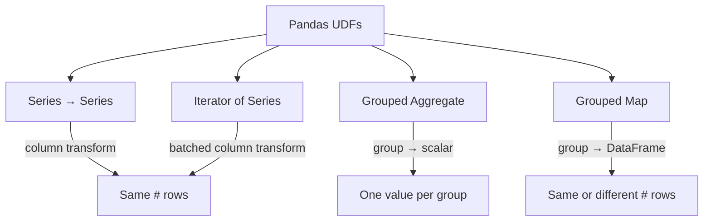

# Pandas UDFs

Pandas UDFs (vectorized UDFs) use Apache Arrow to transfer data in columnar
batches, making them **much faster** than traditional row-at-a-time UDFs.

## UDF Types



| Type | Input | Output | Use Case |
|------|-------|--------|----------|
| [Series → Series](series-to-series.md) | `pd.Series` | `pd.Series` | Column-level math, string ops |
| [Iterator UDF](iterator-udf.md) | `Iterator[pd.Series]` | `Iterator[pd.Series]` | Expensive init (load model once) |
| [Grouped Aggregate](grouped-aggregate.md) | `pd.Series` | scalar | Custom aggregation per group |
| [Grouped Map](grouped-map.md) | `pd.DataFrame` | `pd.DataFrame` | Full group transforms |

## Decorator Syntax

All Pandas UDFs use the `@F.pandas_udf` decorator:

```python
from pyspark.sql import functions as F

@F.pandas_udf("double")              # (1)!
def multiply(a: pd.Series, b: pd.Series) -> pd.Series:
    return a * b
```

1. The string `"double"` declares the Spark return type.

## Run

```bash
python src/psa/pandas_udf_spark.py
```

## Full Example

```python title="src/psa/pandas_udf_spark.py"
--8<-- "src/psa/pandas_udf_spark.py"
```
