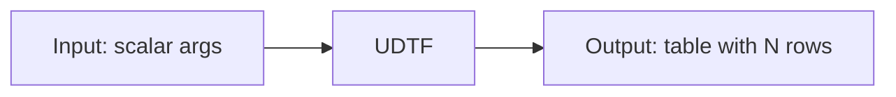

# User-Defined Table Functions (UDTFs)

UDTFs return **multiple rows** from a single function call — unlike UDFs which
return a single value. They are ideal for generating rows, expanding arrays, or
producing tabular output from custom logic.



## UDTF Types

| Type | Feature | Use Case |
|------|---------|----------|
| [Basic UDTF](basic-udtf.md) | `eval()` only | Simple row generation |
| [Lifecycle UDTF](lifecycle-udtf.md) | `__init__` + `eval` + `terminate` | Stateful computation |
| [Arrow UDTF](arrow-udtf.md) | `eval()` with Arrow batches | High-throughput generation |

## Registration

UDTFs are registered with `spark.udtf.register`:

```python
from pyspark.sql.functions import lit

spark.udtf.register("square_numbers", SquareNumbers)
spark.sql("SELECT * FROM square_numbers(5)").show()

# or via DataFrame API:
SquareNumbers(lit(5)).show()
```

## Run

```bash
python src/psa/pyspark_udtf.py
```

## Full Example

```python title="src/psa/pyspark_udtf.py"
--8<-- "src/psa/pyspark_udtf.py"
```
