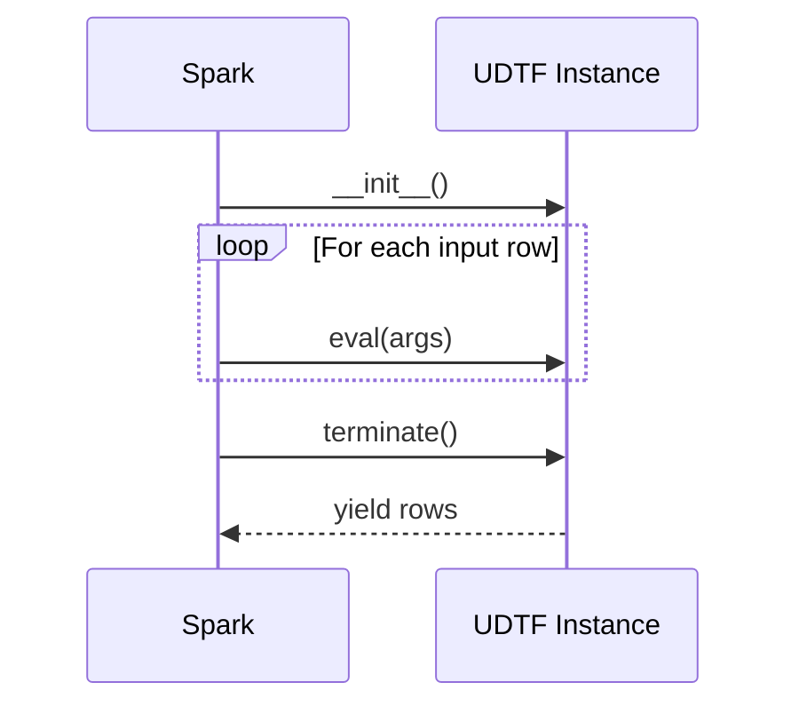

# Lifecycle UDTF

A Lifecycle UDTF uses `__init__`, `eval`, and `terminate` to maintain state
across rows and emit final results.

## Class Structure

```python
from pyspark.sql.functions import udtf

@udtf(returnType="num: int")
class FibonacciNumbers:
    def __init__(self):            # (1)!
        self.results = []

    def eval(self, n: int):        # (2)!
        a, b = 0, 1
        for _ in range(n):
            self.results.append(a)
            a, b = b, a + b

    def terminate(self):           # (3)!
        for num in self.results:
            yield (num,)
```

1. `__init__` — initialise state (runs once per partition).
2. `eval` — accumulate state (runs once per input row, no yields needed).
3. `terminate` — emit all results after all rows are processed.

## Lifecycle Flow



## Usage

```python
spark.udtf.register("fibonacci", FibonacciNumbers)
spark.sql("SELECT * FROM fibonacci(8)").show()
```

## Output

```
+---+
|num|
+---+
|  0|
|  1|
|  1|
|  2|
|  3|
|  5|
|  8|
| 13|
+---+
```

## When to Use

!!! success "Good fit"

    - Accumulating state across rows before emitting results
    - Building lookup tables from multiple input rows
    - Generating summary rows at the end of processing

!!! failure "Not a good fit"

    - Simple row-by-row generation → [Basic UDTF](basic-udtf.md)
    - Large-scale batch output → [Arrow UDTF](arrow-udtf.md)
