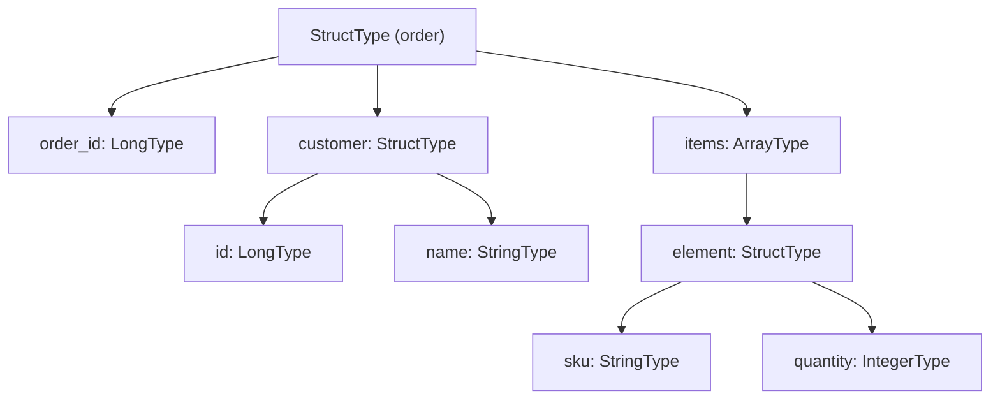
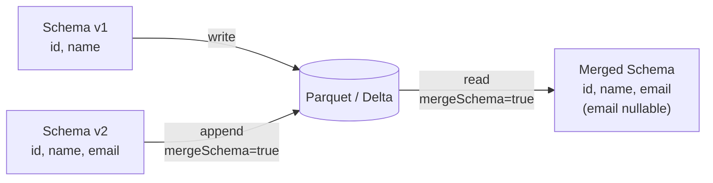

# MkDocs Documentation Instructions — PySpark Schema

## Theme & Config (`mkdocs.yml`)

Use MkDocs Material with the project's standard palette:

```yaml
site_name: PySpark Schema
site_description: Schema definition, validation, evolution, and introspection in PySpark 3.5
theme:
  name: material
  palette:
    - scheme: default
      primary: deep orange
      accent: orange
      toggle:
        icon: material/brightness-7
        name: Switch to dark mode
    - scheme: slate
      primary: deep orange
      accent: orange
      toggle:
        icon: material/brightness-4
        name: Switch to light mode
  features:
    - navigation.tabs
    - navigation.sections
    - navigation.expand
    - navigation.top
    - navigation.indexes
    - search.highlight
    - search.suggest
    - content.code.copy
    - content.code.annotate

plugins:
  - search
  - include-markdown

markdown_extensions:
  - admonition
  - attr_list
  - md_in_html
  - tables
  - pymdownx.details
  - pymdownx.inlinehilite
  - pymdownx.highlight:
      anchor_linenums: true
      line_spans: __span
      pygments_lang_class: true
  - pymdownx.superfences:
      custom_fences:
        - name: mermaid
          class: mermaid
          format: !!python/name:pymdownx.superfences.fence_code_format
  - pymdownx.tabbed:
      alternate_style: true
  - pymdownx.snippets:
      base_path: ["."]
  - toc:
      permalink: true
```

---

## Recommended Site Structure

```
docs/
├── index.md                          # Overview — what schemas are and why they matter
├── definition/
│   ├── struct-field-list.md          # StructType(fields=[...]) pattern
│   ├── builder.md                    # StructType().add() builder pattern
│   └── ddl-string.md                 # fromDDL / DDL string pattern
├── complex-types/
│   ├── arrays.md                     # ArrayType — primitives and structs
│   ├── maps.md                       # MapType
│   └── nested-structs.md             # Deeply nested StructType
├── introspection/
│   ├── print-schema.md               # printSchema, dtypes, simpleString
│   └── column-existence.md           # has_column, AnalysisException
├── validation.md                     # assert_schema, cast_to_schema
├── evolution.md                      # mergeSchema — Parquet and Delta Lake
├── parser.md                         # _parse_datatype_string, JSON round-trip
└── testing.md                        # How to test schema code with pytest
```

Register every new page under `nav:` in `mkdocs.yml`.

---

## Type-Tree Diagram (Mermaid)

Every complex-type page must include a diagram showing the nesting.

### Nested struct example



### Schema evolution flow



### Definition styles comparison

```mermaid
graph LR
    A[StructField list] -->|explicit control| S[StructType]
    B[".add() builder"]  -->|fluent API|      S
    C[DDL string]        -->|fromDDL|         S
    D[JSON string]       -->|fromJson|        S
    S -->|json / simpleString| Serialized[Serialized form]
```

---

## Page Template — Definition Style

Use this structure for every page under `docs/definition/`:

```markdown
# Schema Definition — <Style Name>

One-sentence description of this style and when to prefer it.

## How It Works

Short explanation + type-tree diagram (Mermaid).

## When to Use

!!! success "Good fit"
    - Bullet list of ideal scenarios

!!! failure "Not suitable"
    - Bullet list of cases to avoid

## Code

```python title="src/definition/<file>.py"
--8<-- "src/definition/<file>.py"
```

## Run

```bash
SPARK_MASTER=local[*] python src/definition/<file>.py
```

## Key Points

- Implementation rules specific to this style.
```

## Page Template — Complex Type

```markdown
# <Type Name> Schema

One-sentence description.

## Type Tree

```mermaid
...
```

## Code

```python title="src/arrays/<file>.py"
--8<-- "src/arrays/<file>.py"
```

## Schema Introspection

Show the output of `printSchema()` and `simpleString()` in a `text` block:

```text
root
 |-- id: long (nullable = false)
 |-- tags: array (nullable = true)
 |    |-- element: string (containsNull = true)
```

## Run

```bash
SPARK_MASTER=local[*] python src/arrays/<file>.py
```
```

---

## Code Blocks

### Snippet include (preferred — keeps docs in sync with source)

````markdown
```python title="src/definition/schema_definition_builder.py"
--8<-- "src/definition/schema_definition_builder.py"
```
````

### Tabbed install options

````markdown
=== "pip"
    ```bash
    pip install pyspark==3.5.0
    ```

=== "conda"
    ```bash
    conda install -c conda-forge pyspark=3.5.0
    ```

=== "uv"
    ```bash
    uv add pyspark
    ```
````

### Code annotations

```python
schema = StructType([
    StructField("id",   LongType(),   nullable=False),  # (1)!
    StructField("name", StringType(), nullable=True),   # (2)!
])
```
1. `nullable=False` enforces a NOT NULL constraint at the Spark layer.
2. `nullable=True` allows the column to contain `null` values.

### `printSchema()` output block

Always show schema output in a `text` code block (not `python`):

````markdown
```text
root
 |-- id: long (nullable = false)
 |-- name: string (nullable = true)
```
````

---

## Admonitions

```markdown
!!! tip "Define schema explicitly"
    Never rely on schema inference in production — inferred schemas can change
    silently when source data evolves.

!!! warning "nullable defaults to True"
    If you omit the `nullable` argument on `StructField`, it defaults to `True`.
    Always set it explicitly to avoid surprises.

!!! note "DDL strings require Spark to parse"
    `StructType.fromDDL(...)` calls the Catalyst SQL parser internally.
    Syntax follows Hive DDL — use `BIGINT`, not `LONG`.

!!! success "Good fit for schemas"
    - Reading CSV / JSON / Parquet with a known schema
    - Enforcing contract between producers and consumers
    - Generating documentation from schema metadata

!!! failure "Avoid schema inference when"
    - The data volume is large (inference reads the whole file)
    - The schema must be stable across pipeline versions
```

---

## Building & Serving

```bash
mkdocs serve              # local dev server — http://127.0.0.1:8000
mkdocs build --strict     # production build — fails on warnings (CI)
```
