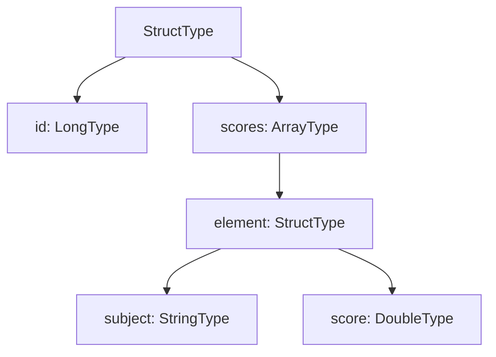

# Arrays

`ArrayType(elementType, containsNull=True)` stores an ordered list of
same-type elements in a single column. The element type can be any Spark type,
including another `StructType`.

## Array of Primitives

```python
from pyspark.sql.types import ArrayType, StringType

schema = StructType([
    StructField("id",   LongType(),              nullable=False),
    StructField("tags", ArrayType(StringType()), nullable=True),
])
```

```text
root
 |-- id: long (nullable = false)
 |-- tags: array (nullable = true)
 |    |-- element: string (containsNull = true)
```

## Array of Structs

```python
item_schema = StructType([
    StructField("subject", StringType(), nullable=False),
    StructField("score",   DoubleType(), nullable=True),
])

schema = StructType([
    StructField("id",     LongType(),              nullable=False),
    StructField("scores", ArrayType(item_schema),  nullable=True),
])
```



## Key Array Functions

| Function | Description |
| -------- | ----------- |
| `F.size(col)` | Number of elements |
| `F.element_at(col, n)` | Get element at 1-based index |
| `F.array_contains(col, val)` | Boolean membership test |
| `F.array_distinct(col)` | Remove duplicates |
| `F.array_join(col, delimiter)` | Concatenate to string |
| `F.slice(col, start, length)` | Sub-array (1-indexed) |
| `F.explode(col)` | One row per element |
| `F.collect_list(col)` | Aggregate rows into an array |

## Create Example

```python title="src/arrays/pyspark_array_schema_create.py"
--8<-- "src/arrays/pyspark_array_schema_create.py"
```

## Read & Transform Example

```python title="src/arrays/pyspark_array_schema_read.py"
--8<-- "src/arrays/pyspark_array_schema_read.py"
```

## Run

```bash
SPARK_MASTER=local[*] python src/arrays/pyspark_array_schema_create.py
SPARK_MASTER=local[*] python src/arrays/pyspark_array_schema_read.py
```

## Key Points

- `containsNull` (second arg of `ArrayType`) controls whether array elements may be `null`.
- Use `F.explode()` to pivot an array column into individual rows before grouping.
- `F.collect_list()` / `F.collect_set()` are the inverse — they aggregate rows into an array.
