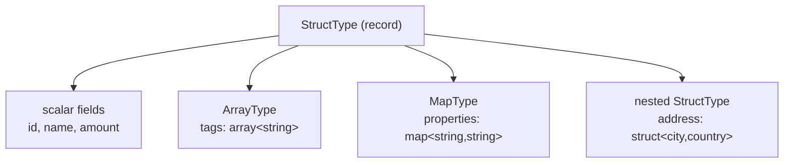

# Complex Types

Spark supports three complex (compound) data types that can be arbitrarily nested.

| Type | API | Description |
| ---- | --- | ----------- |
| `ArrayType` | `ArrayType(elementType)` | Ordered list of same-type elements |
| `MapType` | `MapType(keyType, valueType)` | Key → value dictionary |
| `StructType` | `StructType([StructField…])` | Named, typed, heterogeneous fields |

!!! tip "Arbitrary nesting"
    All three types can be nested inside each other to any depth.
    An `ArrayType` can hold a `StructType`; a `StructType` field can be
    another `StructType`.

See the detailed pages for hands-on examples:

- [Arrays](arrays.md) — primitives, struct arrays, array functions
- [Nested Structs](nested-structs.md) — multi-level nesting, field access
