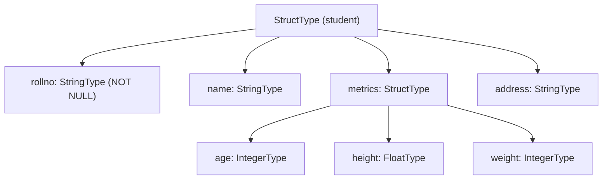

# Nested Structs

A `StructType` field can itself contain another `StructType`, enabling
arbitrarily deep nesting. Access nested columns using **dot-notation**.

## Schema

```python
address_schema = StructType([
    StructField("city",    StringType(), nullable=True),
    StructField("country", StringType(), nullable=True),
])

schema = StructType([
    StructField("rollno",  StringType(), nullable=False),
    StructField("name",    StringType(), nullable=True),
    StructField("metrics", StructType([
        StructField("age",    IntegerType(), nullable=True),
        StructField("height", FloatType(),   nullable=True),
        StructField("weight", IntegerType(), nullable=True),
    ]), nullable=True),
    StructField("address", StringType(), nullable=True),
])
```



## Accessing Nested Columns

```python
# Dot-notation in select
df.select("rollno", "name", F.col("metrics.age").alias("age"))

# Dot-notation in filter
df.filter(F.col("metrics.age") > 18)

# Access nested StructType field metadata
nested_fields = df.schema["metrics"].dataType.fields
```

```text
root
 |-- rollno: string (nullable = false)
 |-- name: string (nullable = true)
 |-- metrics: struct (nullable = true)
 |    |-- age: integer (nullable = true)
 |    |-- height: float (nullable = true)
 |    |-- weight: integer (nullable = true)
 |-- address: string (nullable = true)
```

## Fields Example

```python title="src/arrays/pyspark_array_schema_fields.py"
--8<-- "src/arrays/pyspark_array_schema_fields.py"
```

## Print Example

```python title="src/arrays/pyspark_array_schema_print.py"
--8<-- "src/arrays/pyspark_array_schema_print.py"
```

## Run

```bash
SPARK_MASTER=local[*] python src/arrays/pyspark_array_schema_fields.py
SPARK_MASTER=local[*] python src/arrays/pyspark_array_schema_print.py
```

## Key Points

- Deeply nested schemas should be [flattened](../schema-flattening.md) before writing to columnar sinks that don't support nesting.
- `df.schema["metrics"].dataType` returns the inner `StructType`.
- `df.schema["metrics"].dataType.fieldNames()` gives the nested column name list.
