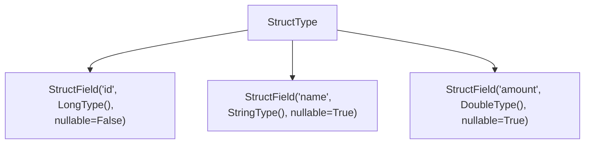
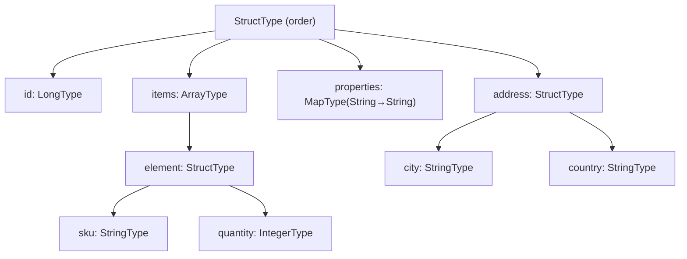

# Core Concepts

## What Is a Schema?

A **schema** is a description of the structure of a DataFrame: the column names,
their data types, and whether each column may contain `null` values.
Spark represents schemas as a `StructType` containing a list of `StructField` objects.



## StructType & StructField

```python
from pyspark.sql.types import StructType, StructField, LongType, StringType, DoubleType

schema = StructType([
    StructField("id",     LongType(),   nullable=False),  # (1)!
    StructField("name",   StringType(), nullable=True),   # (2)!
    StructField("amount", DoubleType(), nullable=True),
])
```

1. `nullable=False` — Spark will reject rows where `id` is `null`.
2. `nullable=True` — `null` is a valid value for this column.

## Scalar Data Types

| PySpark Type | Python / SQL equivalent | Notes |
| ------------ | ----------------------- | ----- |
| `ByteType()` | `int8` / `TINYINT` | −128 to 127 |
| `ShortType()` | `int16` / `SMALLINT` | −32 768 to 32 767 |
| `IntegerType()` | `int32` / `INT` | |
| `LongType()` | `int64` / `BIGINT` | Default for Python `int` |
| `FloatType()` | `float32` / `FLOAT` | |
| `DoubleType()` | `float64` / `DOUBLE` | Default for Python `float` |
| `DecimalType(p, s)` | `DECIMAL(p,s)` | Exact; use for money |
| `StringType()` | `str` / `STRING` | |
| `BooleanType()` | `bool` / `BOOLEAN` | |
| `BinaryType()` | `bytes` / `BINARY` | |
| `DateType()` | `datetime.date` / `DATE` | No time component |
| `TimestampType()` | `datetime.datetime` / `TIMESTAMP` | Microsecond precision |

## Complex Data Types

| PySpark Type | Description |
| ------------ | ----------- |
| `ArrayType(elementType)` | Ordered list of elements of the same type |
| `MapType(keyType, valueType)` | Key → value mapping |
| `StructType([StructField…])` | Named fields — can be nested |



## nullable

`nullable` controls whether a column is allowed to hold `null` values.

!!! warning "Default is True"
    If you omit the third argument of `StructField`, it defaults to `nullable=True`.
    Always set it explicitly to avoid surprises.

```python
StructField("id",   LongType(), nullable=False)  # NOT NULL
StructField("name", StringType(), nullable=True)  # NULL allowed
```

## Schema-First vs Inference

!!! success "Always prefer explicit schemas"
    - Inference reads the entire file, which is slow on large datasets.
    - Inferred schemas can silently change when source data changes.
    - Explicit schemas act as a contract between producers and consumers.

```python
# ✗ inference — fragile in production
df = spark.read.json(path)

# ✓ explicit — safe and fast
df = spark.read.json(path, schema=my_schema)
```

## Schema Serialisation Formats

| Method | Output | Use case |
| ------ | ------ | -------- |
| `schema.simpleString()` | `"struct<id:bigint,name:string>"` | Logging, quick checks |
| `schema.json()` | Full JSON string | Storage, schema registry |
| `schema.jsonValue()` | Python `dict` | In-memory manipulation |
| `schema.printTreeString()` | Human-readable tree | Interactive debugging |
| `StructType.fromDDL(ddl)` | `StructType` | Parse from Hive DDL |
| `StructType.fromJson(d)` | `StructType` | Restore from JSON |
