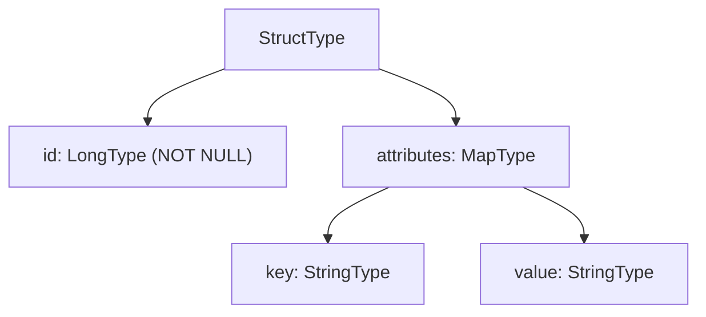

# DDL String & MapType

## DDL String (`fromDDL`)

`StructType.fromDDL()` parses a Hive-compatible DDL string into a `StructType`.
It is the most concise definition style and integrates naturally with Hive
metastore table definitions.

```python
schema = StructType.fromDDL(
    "order_id BIGINT NOT NULL, customer STRING, amount DOUBLE"
)
```

!!! note "DDL type names"
    Use Hive DDL syntax — `BIGINT` not `LONG`, `STRING` not `VARCHAR`.
    `NOT NULL` maps to `nullable=False`.

## MapType

`MapType(keyType, valueType)` represents a dictionary column. Keys and values
can be any Spark type.

```python
from pyspark.sql.types import MapType, StringType, LongType

schema = StructType([
    StructField("id",         LongType(),                           nullable=False),
    StructField("attributes", MapType(StringType(), StringType()),  nullable=True),
])
```



## When to Use

!!! success "Good fit"
    - Schema originates from a Hive metastore or SQL `CREATE TABLE` statement.
    - Columns hold key-value pairs of variable structure (`MapType`).
    - Quick prototyping — DDL strings are compact and readable.

!!! failure "Not suitable"
    - You need `StructField` metadata — `fromDDL` does not support it.

## Code

```python title="src/definition/schema_definition_type2.py"
--8<-- "src/definition/schema_definition_type2.py"
```

## Run

```bash
SPARK_MASTER=local[*] python src/definition/schema_definition_type2.py
```

## Key Points

- `StructType.fromDDL(ddl).simpleString()` is a good sanity-check after parsing.
- JSON roundtrip works identically on `fromDDL`-derived schemas.
- `MapType.valueContainsNull` (third arg) defaults to `True`.
