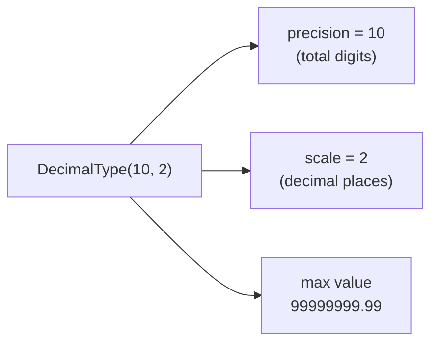

# Decimal Type

`DecimalType(precision, scale)` stores numbers with **exact** fixed-point
arithmetic. Use it wherever floating-point rounding is unacceptable — prices,
taxes, exchange rates, account balances.

## Precision & Scale

| Parameter | Meaning | Example |
| --------- | ------- | ------- |
| `precision` | Total number of significant digits | `DecimalType(10, 2)` holds up to 10 digits |
| `scale` | Digits after the decimal point | `DecimalType(10, 2)` → `99999999.99` max |



## Exact vs Approximate

```python
from decimal import Decimal

data = [(1, Decimal("0.10")), (2, Decimal("0.20")), (3, Decimal("0.30"))]

# DecimalType: 0.10 + 0.20 + 0.30 = 0.60  ✓
# DoubleType:  0.1  + 0.2  + 0.3  = 0.6000000000000001  ✗
```

!!! warning "DoubleType accumulates error"
    Never use `DoubleType` for currency or anything requiring exact summation.
    Use `DecimalType(18, 2)` for monetary columns.

## Common Presets

| Use Case | Type |
| -------- | ---- |
| Price / amount | `DecimalType(18, 2)` |
| Exchange rate / percentage | `DecimalType(10, 6)` |
| Quantity (no decimal) | `DecimalType(15, 0)` |
| Maximum precision (Spark) | `DecimalType(38, 10)` |

## When to Use

!!! success "Good fit"
    - Financial amounts, prices, taxes, fees.
    - Any column where `SUM` or `AVG` must be exact.
    - Data that will be compared with `==` after arithmetic.

!!! failure "Not suitable"
    - Scientific data where approximation is acceptable — use `DoubleType`.
    - Very large numbers beyond `DecimalType(38, …)`.

## Code

```python title="src/definition/schema_decimal_type.py"
--8<-- "src/definition/schema_decimal_type.py"
```

## Run

```bash
SPARK_MASTER=local[*] python src/definition/schema_decimal_type.py
```

## Key Points

- Pass `Decimal("3.14")` (string constructor) — never `Decimal(3.14)` which inherits float error.
- Cast with `F.col("amount").cast(DecimalType(18, 2))` to enforce precision on ingested data.
- `df.schema["amount"].dataType.precision` and `.scale` are readable at runtime.
