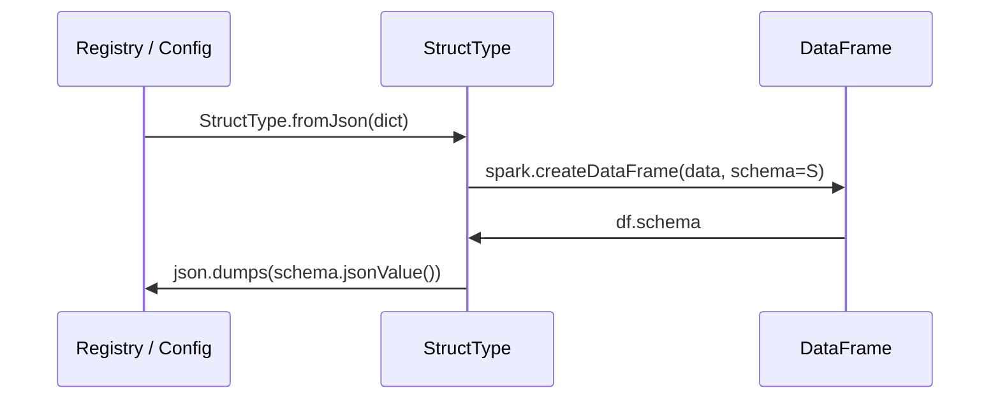

# Schema from JSON

Load and store schemas as JSON — the standard interchange format for a **schema
registry** or external configuration file.

## How It Works



The JSON format is the same dict produced by `schema.jsonValue()` — a `type`
key with value `"struct"` and a `fields` list.

```json
{
  "type": "struct",
  "fields": [
    {"name": "order_id", "type": "long",   "nullable": false, "metadata": {}},
    {"name": "customer", "type": "string", "nullable": true,  "metadata": {}},
    {"name": "amount",   "type": "double", "nullable": true,  "metadata": {}}
  ]
}
```

## Roundtrip

```python
import json
from pyspark.sql.types import StructType

schema_json  = schema.json()                            # → JSON string
schema_back  = StructType.fromJson(json.loads(schema_json))
assert schema == schema_back
```

## When to Use

!!! success "Good fit"
    - Storing schemas in object storage (S3, GCS, ADLS).
    - A schema registry (Confluent, Glue Schema Registry).
    - Sharing schemas between services over HTTP.
    - Evolving schemas by patching the `fields` list in code.

!!! failure "Not suitable"
    - One-off scripts where a literal definition is simpler.

## Code

```python title="src/definition/schema_from_json.py"
--8<-- "src/definition/schema_from_json.py"
```

## Run

```bash
SPARK_MASTER=local[*] python src/definition/schema_from_json.py
```

## Key Points

- `schema.json()` returns a **string**; `schema.jsonValue()` returns a **dict**.
- `StructType.fromJson()` expects a **dict** — call `json.loads()` first if you have a string.
- Metadata attached to `StructField` objects is preserved through the roundtrip.
