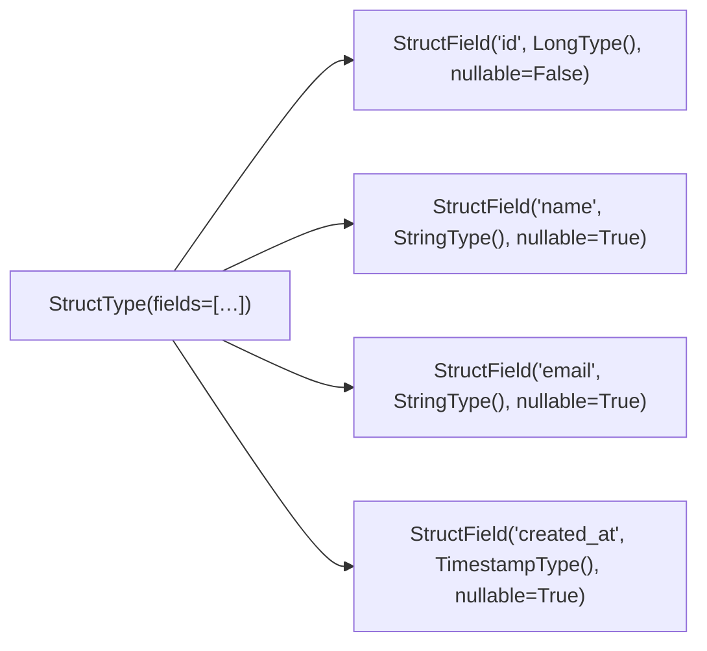

# StructField List

The most explicit definition style. Pass a Python list of `StructField` objects
to `StructType(fields=[…])`. Every field has a name, a data type, and an
explicit `nullable` flag.

## How It Works



## When to Use

!!! success "Good fit"
    - You need full control over every field attribute.
    - The schema is defined once and referenced across multiple scripts.
    - You want to make `nullable` constraints visible and reviewable.

!!! failure "Not suitable"
    - You are building a schema dynamically at runtime — use the builder instead.

## Code

```python title="src/spark_schema.py"
--8<-- "src/spark_schema.py"
```

## Run

```bash
SPARK_MASTER=local[*] python src/spark_schema.py
```

## Key Points

- Always set `nullable` explicitly — the default (`True`) is easy to miss.
- Pass a module-level `schema` constant; don't define it inside `if __name__`.
- Use `INPUT_PATH` env var with an in-memory fallback so the script works without files.
