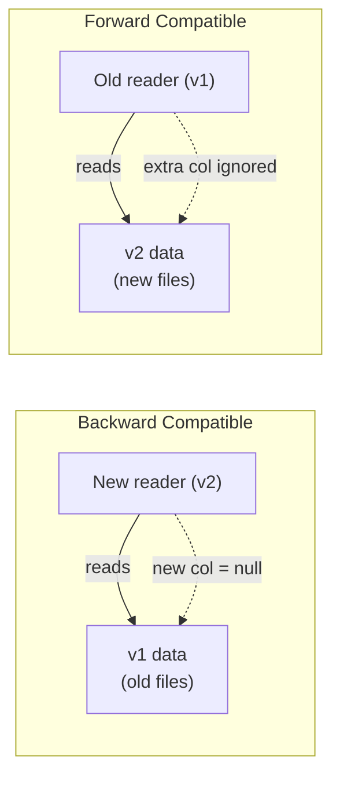

# Backward & Forward Compatibility

When a pipeline writes Parquet with one schema and later reads it with another,
you need to understand two compatibility directions.

## Compatibility Definitions



| Direction | Reader | Writer | New column behaviour |
| --------- | ------ | ------ | -------------------- |
| **Backward** | v2 (new) | v1 (old) | Missing column → `null` (OK if nullable) |
| **Forward** | v1 (old) | v2 (new) | Extra column silently dropped |

## Reading with an Explicit Schema

Use `spark.read.schema(schema).parquet(path)` to force a specific schema:

```python
# Backward: new reader reads old files — 'region' will be null
df = spark.read.schema(SCHEMA_V2).parquet(path_v1)

# Forward: old reader reads new files — 'region' column is ignored
df = spark.read.schema(SCHEMA_V1).parquet(path_v2)
```

!!! tip "Validate before deploying a schema change"
    Run [`is_backward_compatible(new_schema, old_schema)`](../validation.md)
    in your CI pipeline before merging any schema change.

## Safe Evolution Rules

| Change | Backward | Forward |
| ------ | -------- | ------- |
| Add nullable column | ✓ | ✓ |
| Add non-nullable column | ✗ | ✓ |
| Remove column | ✓ | ✗ |
| Change type (widening, e.g. int→long) | depends | ✗ |
| Rename column | ✗ | ✗ |

## Code

```python title="src/evolution/schema_backward_compat.py"
--8<-- "src/evolution/schema_backward_compat.py"
```

## Run

```bash
SPARK_MASTER=local[*] python src/evolution/schema_backward_compat.py
```

## Key Points

- Always add new columns as `nullable=True` to maintain both directions.
- Test with both `spark.read.schema(v2).parquet(v1_path)` and `mergeSchema=true` to verify behaviour.
- Removing or renaming columns breaks both directions — use an alias or a view layer instead.
