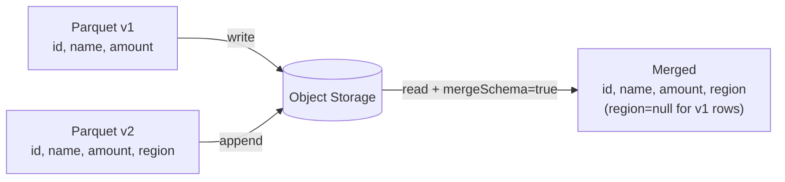

# Merge Schema

`mergeSchema` lets Parquet readers unify schemas across files written with
different column sets — the primary mechanism for **Parquet schema evolution**.

## How It Works



New columns that appear in later files are **nullable** for rows from earlier
files — they will be read as `null`.

## Write Side

```python
df_v1.write.mode("overwrite").parquet(path_v1)  # no special option needed
df_v2.write.mode("overwrite").parquet(path_v2)
```

## Read Side

```python
merged = (spark.read
          .option("mergeSchema", "true")
          .parquet(path_v1, path_v2))
```

Or enable globally for the session:

```python
spark.conf.set("spark.sql.parquet.mergeSchema", "true")
```

!!! warning "Performance cost"
    `mergeSchema` reads the footer of every file to collect schemas.
    For large datasets with many small files, this adds significant overhead.
    Prefer explicit schemas for production pipelines.

## When to Use

!!! success "Good fit"
    - Exploratory analysis across historical Parquet partitions.
    - Pipelines where new columns are added over time.
    - Backfilling missing partitions after a schema change.

!!! failure "Not suitable"
    - Production pipelines where schema stability is critical.
    - When a type change (not just a new column) has occurred.

## Code

```python title="src/evolution/schema_merge.py"
--8<-- "src/evolution/schema_merge.py"
```

## Run

```bash
SPARK_MASTER=local[*] python src/evolution/schema_merge.py
```

## Key Points

- Only **additive** changes (new nullable columns) are handled gracefully.
- Type changes or column removals can cause read failures — check with [`schema_diff`](../validation.md) first.
- The merged schema includes all columns from all files; missing values are `null`.
