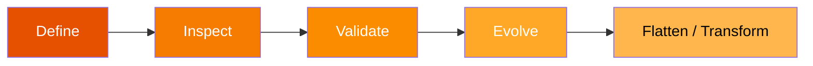

# PySpark Schema

A **complete reference for working with schemas in PySpark 3.5**. Every example
is self-contained, runnable locally with `local[*]`, and uses explicit schemas
rather than inference — the production-safe approach.

## What You Will Learn



| Area | What It Covers |
| ---- | -------------- |
| **Schema Definition** | `StructField` list, builder (`.add()`), DDL string, JSON roundtrip, `MapType`, `DecimalType` |
| **Complex Types** | `ArrayType` (primitives & structs), deeply nested `StructType` |
| **Introspection** | `printSchema`, `dtypes`, `simpleString`, column existence checks |
| **Validation & Comparison** | `validate_schema`, `cast_to_schema`, `schema_diff`, compatibility check |
| **Schema Evolution** | Parquet `mergeSchema`, backward/forward compatibility |
| **Flattening** | Recursive dot-notation flatten, `flatten_df` |
| **Dates & Timestamps** | `DateType`, `TimestampType`, parsing, arithmetic |
| **Metadata & PII** | `StructField` metadata dict, PII tagging, redaction |

## Quick Start

=== "pip"
    ```bash
    pip install pyspark==3.5.0
    ```

=== "conda"
    ```bash
    conda install -c conda-forge pyspark=3.5.0
    ```

=== "uv"
    ```bash
    uv add pyspark
    ```

```bash
SPARK_MASTER=local[*] python src/spark_schema.py
```

## Project Layout

```
src/
├── spark_schema.py              # Quickstart — StructField list
├── definition/                  # Schema definition styles
│   ├── schema_definition_builder.py
│   ├── schema_definition_type2.py
│   ├── schema_from_json.py
│   └── schema_decimal_type.py
├── arrays/                      # ArrayType & nested struct schemas
├── column/                      # Column introspection helpers
├── evolution/                   # mergeSchema & compatibility
├── parser/                      # DDL type-string parsing
├── schema_comparison.py         # schema_diff + compatibility
├── schema_flattening.py         # Recursive flatten utilities
├── schema_dates.py              # DateType / TimestampType
└── schema_metadata.py           # StructField metadata & PII
```

!!! tip "No cluster needed"
    Every script runs on your laptop with `SPARK_MASTER=local[*]` — the default
    when no environment variable is set.

!!! warning "Java required"
    Java 11 must be on your `PATH`. Check with `java -version`.
