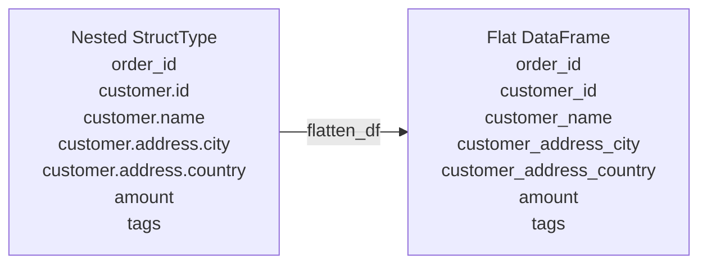

# Schema Flattening

Deep nesting makes downstream analytics harder — columnar query engines,
BI tools, and most CSV sinks expect a flat table. The `flatten_schema` utility
recursively resolves all nested struct fields to dot-notation paths, and
`flatten_df` applies that as a `select`.

## How It Works



## Utility Functions

```python
def flatten_schema(schema: StructType, prefix: str = "") -> list[tuple[str, str]]:
    """Returns (dot_path, type_simpleString) for every leaf field."""
    paths = []
    for field in schema.fields:
        full = f"{prefix}.{field.name}" if prefix else field.name
        if isinstance(field.dataType, StructType):
            paths.extend(flatten_schema(field.dataType, full))
        else:
            paths.append((full, field.dataType.simpleString()))
    return paths

def flatten_df(df: DataFrame) -> DataFrame:
    """Select all leaf columns with underscored aliases."""
    return df.select([
        F.col(path).alias(path.replace(".", "_"))
        for path, _ in flatten_schema(df.schema)
    ])
```

!!! note "ArrayType columns"
    `flatten_schema` lists `ArrayType` columns as leaf nodes (it does not
    recurse into array element types). Use `F.explode()` after flattening
    to further unpack array columns.

## When to Use

!!! success "Good fit"
    - Writing nested data to CSV or JDBC sinks.
    - Before grouping or aggregating on deeply nested fields.
    - Generating a flat schema summary for documentation.

!!! failure "Not suitable"
    - When nesting carries semantic meaning you need to preserve.
    - Schemas with many thousands of nested fields (deeply recursive cost).

## Code

```python title="src/schema_flattening.py"
--8<-- "src/schema_flattening.py"
```

## Run

```bash
SPARK_MASTER=local[*] python src/schema_flattening.py
```

## Key Points

- Dot-notation paths are valid in `F.col("a.b.c")` and `df["a.b.c"]`.
- Replace dots with underscores for output column names to avoid conflicts.
- After flattening, run `df.printSchema()` to verify the result before writing.
