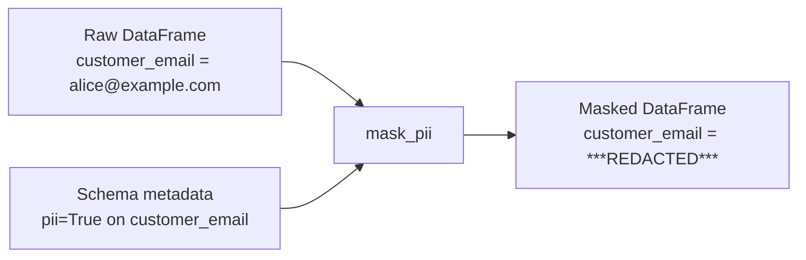

# Metadata & PII Tagging

Every `StructField` accepts an optional `metadata` dict — a free-form
key/value store attached to the field definition. Use it to carry
documentation, data classification, and PII tags alongside the schema.

## Attaching Metadata

```python
from pyspark.sql.types import StructField, StringType

StructField(
    "customer_email",
    StringType(),
    nullable=True,
    metadata={
        "description":  "Customer email address",
        "pii":          True,
        "classification": "confidential",
    }
)
```

The metadata dict is preserved through:

- `schema.json()` / `StructType.fromJson()` roundtrips
- Parquet write/read cycles
- `df.withColumn` and `df.select` (column operations strip metadata — re-attach if needed)

## PII Discovery & Redaction

```python
def get_pii_columns(schema: StructType) -> list[str]:
    return [f.name for f in schema.fields if f.metadata.get("pii") is True]

def mask_pii(df: DataFrame, schema: StructType) -> DataFrame:
    for col in get_pii_columns(schema):
        df = df.withColumn(col, F.lit("***REDACTED***"))
    return df
```



## Common Metadata Keys

| Key | Values | Purpose |
| --- | ------ | ------- |
| `description` | string | Human-readable field description |
| `pii` | `true` / `false` | Personally identifiable information flag |
| `classification` | `"public"`, `"internal"`, `"confidential"` | Data classification tier |
| `unit` | `"USD"`, `"ms"`, `"kg"` | Unit of measure |
| `owner` | `"team-payments"` | Owning team |

## When to Use

!!! success "Good fit"
    - Self-documenting schemas for data catalogues.
    - Automated PII detection and redaction in pipelines.
    - Attaching lineage or version information to fields.

!!! failure "Not suitable"
    - Enforcing constraints — metadata is advisory only; Spark does not act on it.
    - Column operations (`withColumn`) strip metadata; store the annotated schema separately.

## Code

```python title="src/schema_metadata.py"
--8<-- "src/schema_metadata.py"
```

## Run

```bash
SPARK_MASTER=local[*] python src/schema_metadata.py
```

## Key Points

- `field.metadata` is a `dict` — access with `.get("pii", False)` to avoid `KeyError`.
- Metadata **survives** `schema.json()` / `StructType.fromJson()` roundtrips.
- Metadata is **stripped** by `df.withColumn` and `df.select` — re-attach with `.alias(name)` or store the annotated `StructType` separately.
